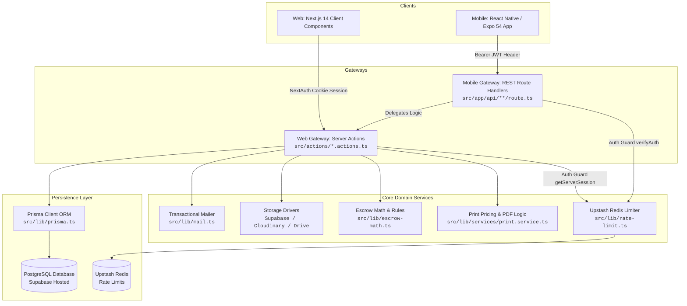
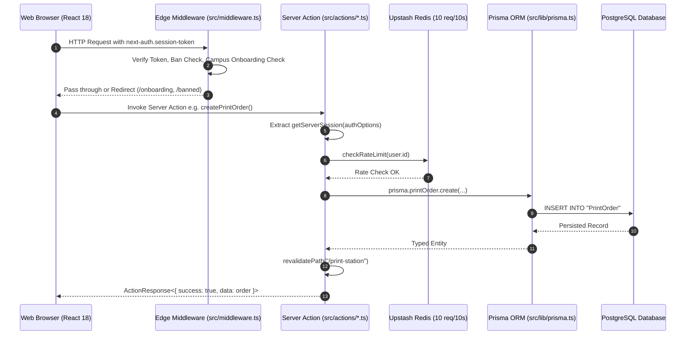
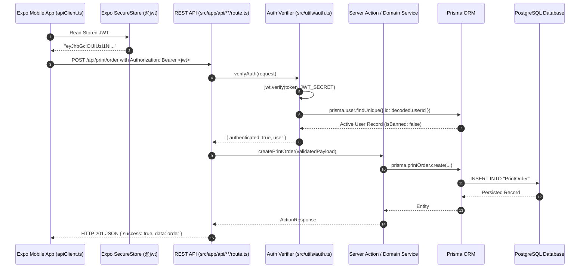
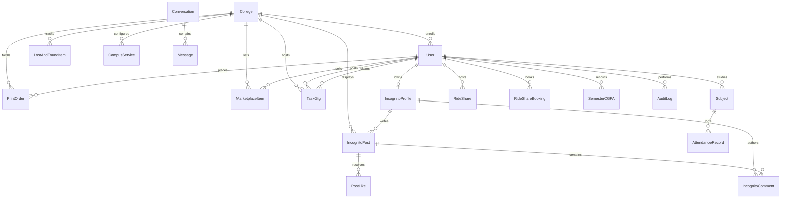
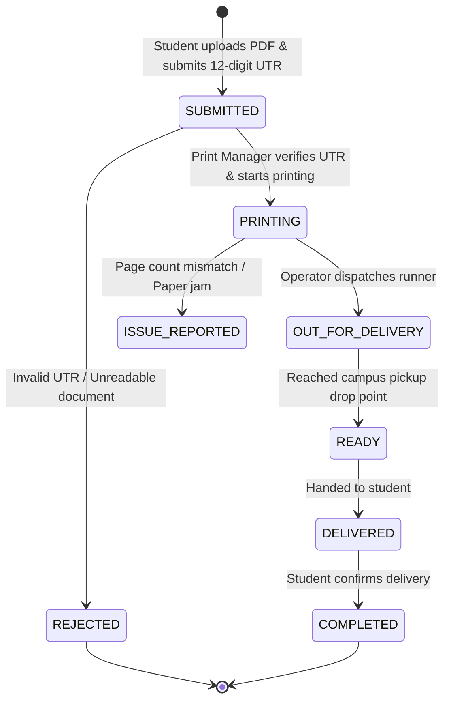
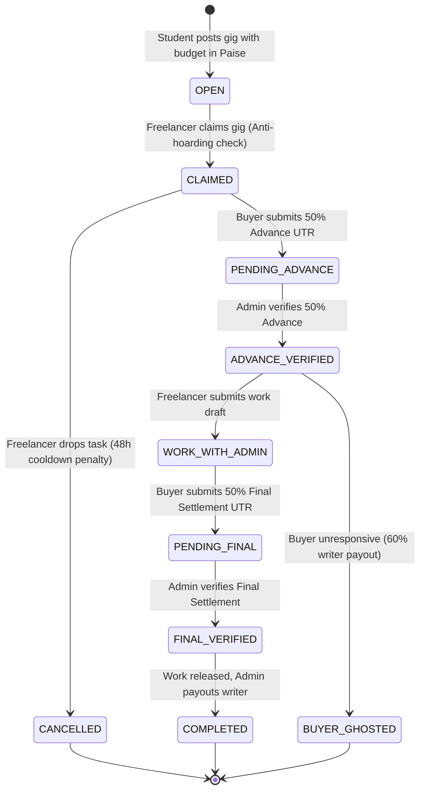

# Otium Uni Hub — Backend Architecture & Multi-Platform API Specification

> **Target Audience:** AI Engineering Agents & Human Backend Developers  
> **Status:** Living Master Specification  
> **Rule for Agents:** You **MUST** read this document before creating, altering, or extending ANY backend code, Server Actions, API route handlers, database schemas, or storage workflows. After making **ANY** backend change, you **MUST** update this document to keep it synchronized with the codebase.

---

## Table of Contents
1. [Agent Operational Directives & Rules of Engagement](#1-agent-operational-directives--rules-of-engagement)
2. [High-Level Backend Architectural Flow](#2-high-level-backend-architectural-flow)
   - [A. The Dual-Gateway Architecture (Server Actions vs REST APIs)](#a-the-dual-gateway-architecture-server-actions-vs-rest-apis)
   - [B. Web Platform Flow (Next.js 14 Server Actions)](#b-web-platform-flow-nextjs-14-server-actions)
   - [C. Mobile Platform Flow (React Native / Expo REST API)](#c-mobile-platform-flow-react-native--expo-rest-api)
   - [D. Gateway Parity Map (Server Action ↔ REST Endpoint)](#d-gateway-parity-map-server-action--rest-endpoint)
3. [Authentication, Session & Authorization Engine](#3-authentication-session--authorization-engine)
   - [The Unified Google OAuth Pipeline (`/api/auth/google`)](#the-unified-google-oauth-pipeline-apiauthgoogle)
   - [Web Session Management (NextAuth JWT + HTTP-Only Cookies)](#web-session-management-nextauth-jwt--http-only-cookies)
   - [Mobile Session Management (Bearer JWT + Expo SecureStore)](#mobile-session-management-bearer-jwt--expo-securestore)
   - [Edge Middleware, Onboarding Gates & Ban Enforcement](#edge-middleware-onboarding-gates--ban-enforcement)
   - [Role-Based Access Control (RBAC Hierarchy)](#role-based-access-control-rbac-hierarchy)
4. [Database Architecture & Multi-Campus Multi-Tenancy](#4-database-architecture--multi-campus-multi-tenancy)
   - [Prisma ORM & PostgreSQL Connection Topology](#prisma-orm--postgresql-connection-topology)
   - [Relational Data Model Overview](#relational-data-model-overview)
   - [Multi-Campus Isolation Strategy (`collegeId` Partitioning)](#multi-campus-isolation-strategy-collegeid-partitioning)
   - [Campus Service Guard & Dynamic Maintenance Kill-Switches](#campus-service-guard--dynamic-maintenance-kill-switches)
   - [The Strict Integer Paise Currency Rule](#the-strict-integer-paise-currency-rule)
5. [Subsystem Backend Workflows & State Machines](#5-subsystem-backend-workflows--state-machines)
   - [1. Express Printing Engine](#1-express-printing-engine)
   - [2. Whisper Wall & Cryptographic Blind ID Chat](#2-whisper-wall--cryptographic-blind-id-chat)
   - [3. Managed Proxy Escrow & Campus Freelance Gigs](#3-managed-proxy-escrow--campus-freelance-gigs)
   - [4. 75% Attendance Guardrail & Offline Sync Engine](#4-75-attendance-guardrail--offline-sync-engine)
   - [5. Student Marketplace & Campus Lost & Found](#5-student-marketplace--campus-lost--found)
   - [6. Cab Split & RideShare Pooling](#6-cab-split--rideshare-pooling)
   - [7. CGPA & Academic Semester Forecaster](#7-cgpa--academic-semester-forecaster)
6. [Storage, Media & Document Pipeline](#6-storage-media--document-pipeline)
   - [Supabase Storage Architecture (`print-documents` Bucket)](#supabase-storage-architecture-print-documents-bucket)
   - [Cloudinary Media Delivery with Cryptographic Client Signatures](#cloudinary-media-delivery-with-cryptographic-client-signatures)
   - [Google Drive Resumable Upload Sessions](#google-drive-resumable-upload-sessions)
   - [Automated Storage Garbage Collection & PDF Pruning](#automated-storage-garbage-collection--pdf-pruning)
7. [Security, Rate Limiting & Admin Audit Logging](#7-security-rate-limiting--admin-audit-logging)
   - [Upstash Redis Sliding-Window Rate Limiting](#upstash-redis-sliding-window-rate-limiting)
   - [Immutable Admin Action Audit Trail](#immutable-admin-action-audit-trail)
   - [Anti-Hoarding & Freelancer Concurrency Controls](#anti-hoarding--freelancer-concurrency-controls)
8. [Agent Maintenance Checklist & Updating Rules](#8-agent-maintenance-checklist--updating-rules)

---

## 1. Agent Operational Directives & Rules of Engagement

### ⚠️ MANDATORY RULES FOR ALL AI AGENTS & BACKEND ENGINEERS:

1. **DOCUMENT SYNCHRONIZATION OBLIGATION**:
   Whenever you introduce new API routes, modify Server Actions, update Prisma schemas, run migrations, adjust rate limits, or change business logic, you **must immediately update this file (`BACKEND_ARCHITECTURE.md`)**. Leaving this master specification out of sync with code is strictly prohibited.

2. **THE STRICT INTEGER PAISE CURRENCY RULE**:
   - **Never store floating-point currency numbers in the database** (e.g. `2.50`, `150.75`).
   - Every financial value across all models (`PrintOrder.totalCost`, `PrintSetting.singleSidedRate`, `MarketplaceItem.price`, `TaskGig.budget`, `RideShare.splitCostEstimate`) **MUST be stored strictly as an integer in Paise** (`1 INR = 100 Paise`).
   - Use `rupeesToPaise()` and `formatPaiseToRupees()` from `src/lib/utils.ts` for all boundary transformations.

3. **ZERO-KNOWLEDGE ANONYMITY & CRYPTOGRAPHIC BLIND IDs**:
   - In anonymous Whisper Wall chat threads, student raw `User.id`, `name`, `email`, and avatar are **NEVER** stored or exposed.
   - You must always compute deterministic salted hashes using `getBlindParticipantId(userId)` (`sha256`) in `src/actions/chat.actions.ts`.
   - Anonymous messages must have `senderId: null` in the database and only populate `anonSenderId`.

4. **SLIDING WINDOW RATE LIMITING ON ALL MUTATIONS**:
   - Every mutating Server Action or state-altering API endpoint **MUST** invoke `checkRateLimit(identifier)` from `src/lib/rate-limit.ts` before executing database writes.
   - Default sliding window limit is **10 requests per 10 seconds** via Upstash Redis (falling back to an in-memory sliding bucket if Redis is disconnected).

5. **MULTI-CAMPUS DATA ISOLATION DISCIPLINE**:
   - Never write queries that fetch unbounded global records for campus-scoped domains (`MarketplaceItem`, `PrintOrder`, `IncognitoPost`, `CampusService`, `TaskGig`).
   - Always filter queries with `where: { collegeId }` unless explicitly querying super-admin cross-campus telemetry.

6. **SERVER ACTION & REST API PARITY**:
   - Otium Uni Hub operates a Next.js 14 Web client and an Expo React Native Mobile client.
   - Whenever you create a new Server Action in `src/actions/*.actions.ts`, you **must provide a corresponding REST API Route Handler in `src/app/api/...`** (or ensure the mobile client has an accessible endpoint) that delegates cleanly to the action or domain service.
   - REST API Route Handlers must always implement `OPTIONS` preflight responses returning HTTP 204.

7. **VERIFICATION BEFORE CONCLUDING**:
   - Run `npx prisma validate` to confirm schema integrity.
   - Run `npx tsc --noEmit` in root to verify backend TypeScript types.
   - Run `npx tsc --noEmit` in `mobile/` to ensure mobile API clients compile against type changes.

---

## 2. High-Level Backend Architectural Flow

### A. The Dual-Gateway Architecture (Server Actions vs REST APIs)

Otium Uni Hub employs a **Unified Core, Dual-Gateway** backend topology:



---

### B. Web Platform Flow (Next.js 14 Server Actions)



---

### C. Mobile Platform Flow (React Native / Expo REST API)



---

### D. Gateway Parity Map (Server Action ↔ REST Endpoint)

| Subsystem Domain | Web Server Action (`src/actions/`) | Mobile REST Route (`src/app/api/`) | Primary Authentication | Key Shared Functionality |
| :--- | :--- | :--- | :--- | :--- |
| **Authentication** | Handled by NextAuth callback | `POST /api/auth/google`<br/>`GET /api/auth/me` | Google OAuth / Custom JWT | Unified Google ID token validation, auto-provisioning `IncognitoProfile`, college domain matching |
| **Express Print** | `createPrintOrder`<br/>`getPrintOrders`<br/>`reportPrintOrderIssue` | `POST /api/print/order`<br/>`GET /api/print/order`<br/>`POST /api/print/issue` | Session Cookie / Bearer JWT | PDF page verification (`pdf-lib`), Paise pricing, UTR validation |
| **Print Upload** | `uploadPrintDocument` | `POST /api/print/upload` | Multipart/Form-Data | Direct Supabase Storage buffer streaming (`print-documents`) |
| **Whisper Wall** | `getIncognitoPosts`<br/>`createIncognitoPost`<br/>`togglePostLike` | `GET /api/incognito`<br/>`POST /api/incognito` | Bearer JWT / Cookie | Campus vs Global scoping, DiceBear Bottts avatar generator |
| **Campus Messaging** | `getUserConversations`<br/>`getConversationMessages`<br/>`sendMessage` | `GET /api/chat`<br/>`POST /api/chat`<br/>`GET /api/chat/[id]/messages`<br/>`POST /api/chat/[id]/messages` | Bearer JWT / Cookie | Cryptographic Blind IDs (`sha256`) for anonymous threads, realtime pub-sub |
| **Freelance Gigs** | `getGigs`<br/>`createGig`<br/>`claimGig`<br/>`submitAdvanceUtr` | `GET /api/gigs`<br/>`POST /api/gigs` | Bearer JWT / Cookie | 10-stage escrow machine, anti-hoarding concurrency locks, cooldown penalty |
| **Smart Attendance** | `getSubjects`<br/>`createSubject`<br/>`logAttendanceSession`<br/>`syncOfflineAttendance` | `GET /api/attendance`<br/>`POST /api/attendance` | Bearer JWT / Cookie | Multi-period lab weights, offline bulk reconciliation algorithm |
| **Marketplace** | `getMarketplaceItems`<br/>`createMarketplaceItem`<br/>`markItemAsSold` | `GET /api/marketplace`<br/>`POST /api/marketplace` | Bearer JWT / Cookie | Paise price storage, condition validation, campus segregation |
| **Cab RideShare** | `getRides`<br/>`createRide`<br/>`bookRideSeat` | `GET /api/rideshare`<br/>`POST /api/rideshare` | Bearer JWT / Cookie | Available seat tracking, departure chronology sorting |
| **Lost & Found** | `getLostAndFoundItems`<br/>`reportLostItem`<br/>`claimLostItem` | `GET /api/lost-and-found`<br/>`POST /api/lost-and-found` | Bearer JWT / Cookie | Finder registration, campus isolation, photo attachments |
| **CGPA Forecaster** | `getSemesterRecords`<br/>`saveSemesterRecord` | `GET /api/cgpa`<br/>`POST /api/cgpa` | Bearer JWT / Cookie | JSON courses serialization, 10-point scale calculations |
| **Service Guard** | `getCampusServices`<br/>`toggleCampusService` | `GET /api/services` | Public / Bearer JWT | Multi-campus feature flags, maintenance outage notifications |
| **Admin Operations** | `getAllPrintOrdersAdmin`<br/>`updatePrintOrderStatus`<br/>`pruneOrphanedStorageAction` | Admin Restricted Pages | NextAuth Session Role Guard | Role-based verification, 60s signed print tokens, React Email alerts |

---

## 3. Authentication, Session & Authorization Engine

### The Unified Google OAuth Pipeline (`/api/auth/google`)

The endpoint `POST /api/auth/google` serves as the universal authentication hub for both mobile and web clients:

```typescript
// Architectural Flow of POST /api/auth/google:
1. Accepts { idToken, credential, accessToken } from Web or Native Mobile.
2. Validates Google Token against allowed Client IDs:
   - Web Client ID: process.env.GOOGLE_CLIENT_ID / NEXT_PUBLIC_GOOGLE_CLIENT_ID
   - Android Client ID: process.env.GOOGLE_ANDROID_CLIENT_ID / EXPO_PUBLIC_GOOGLE_ANDROID_CLIENT_ID
   - Verifies cryptographically via Google OAuth2Client or https://oauth2.googleapis.com/tokeninfo
3. Extracts normalized lowercase email, student name, and Google profile picture.
4. Campus Domain Matching:
   - Scans College records in Prisma for matching domain or code.
   - If matched, pre-assigns collegeId; otherwise leaves collegeId: null to trigger Onboarding Intercept.
5. Upserts User in PostgreSQL via Prisma.
6. Auto-Provisions IncognitoProfile:
   - If profile does not exist, generates handle `Anon_${cleanName}_${randomSuffix}`
   - Sets avatarUrl: `https://api.dicebear.com/9.x/bottts/svg?seed=${handle}`
7. Dual-Token Issuance:
   - Issues 30-Day HMAC-SHA256 JWT for Mobile API access (`signToken`).
   - Issues NextAuth JWE encrypted session token for Web browsers (`encode`).
8. Sets HTTP-Only cookies on response:
   - `next-auth.session-token` (and `__Secure-next-auth.session-token` in HTTPS)
   - `otium_token`
9. Returns JSON with { success: true, token, user } so mobile can store token in SecureStore.
```

---

### Web Session Management (NextAuth JWT + HTTP-Only Cookies)

- Configured in `src/lib/auth.ts` via `authOptions`.
- **Strategy**: `session: { strategy: "jwt", maxAge: 30 * 24 * 60 * 60 }` (30 days).
- **Callbacks**:
  - `jwt()`: Injects `id`, `role`, `collegeId`, and `isBanned` into the NextAuth token. Whenever `token.id` is present, it syncs fresh permissions directly from the Prisma database to prevent stale roles.
  - `session()`: Exposes `user.id`, `user.role`, `user.collegeId`, and `user.isBanned` to client-side components.
- **Client Hydration**: Client components read session state via `UserContext.tsx`, which restores profile data in **0ms** from `sessionStorage` (`otium_cached_web_user`) and validates against `/api/auth/me` in the background.

---

### Mobile Session Management (Bearer JWT + Expo SecureStore)

- **Storage**: Mobile stores the custom JWT in hardware-backed secure storage via `expo-secure-store` under the key `jwt`.
- **Profile Cache**: Stored in `AsyncStorage` under `@otium_cached_user` and `@otium_selected_campus`.
- **Network Dispatch (`mobile/src/services/apiClient.ts`)**:
  - Automatically injects `Authorization: Bearer ${authToken}` on all outgoing HTTP calls.
  - Provides configurable request timeouts (default **15s**, file uploads **90s**).
- **Offline Session Resilience**:
  - On app boot, if the server is unreachable or offline, the app **NEVER** logs the student out.
  - It only clears the stored token if the backend explicitly responds with HTTP `401 Unauthorized`.

---

### Edge Middleware, Onboarding Gates & Ban Enforcement

Configured in `src/middleware.ts` running at Edge runtime across all protected routes:

```mermaid
flowchart TD
    Req[Incoming Web Request] --> AuthCheck{Authorized Session?}
    AuthCheck -->|No| LoginRedirect[Redirect to /login]
    AuthCheck -->|Yes| BanCheck{user.isBanned === true?}
    BanCheck -->|Yes| BanRedirect[Redirect to /banned]
    BanCheck -->|No| CampusCheck{!user.collegeId?}
    CampusCheck -->|Yes| OnboardingRedirect[Redirect to /onboarding]
    CampusCheck -->|No| RoleCheck{Path starts with /admin?}
    RoleCheck -->|No| Allow[NextResponse.next()]
    RoleCheck -->|Yes| AdminType{Admin Subpath?}
    AdminType -->|/admin/print| PrintRoleCheck{Role is PRINT_MANAGER or SUPER_ADMIN?}
    AdminType -->|/admin/colleges or users| SuperAdminCheck{Role is SUPER_ADMIN?}
    PrintRoleCheck -->|Yes| Allow
    PrintRoleCheck -->|No| Deny[Redirect to /]
    SuperAdminCheck -->|Yes| Allow
    SuperAdminCheck -->|No| DenyRole[Redirect to /admin/print or /]
```

---

### Role-Based Access Control (RBAC Hierarchy)

Defined by the `Role` enum in `prisma/schema.prisma`:

| Role | Permissions & Scope |
| :--- | :--- |
| **`STUDENT`** | Default role. Can place print orders, post/claim gigs, list marketplace items, join rideshares, log attendance, track CGPA, and post on Whisper Wall. Scoped to their assigned `collegeId`. |
| **`PRINT_MANAGER`** | Campus Print Station Operator. Access to `/admin/print`. Can view and manage print orders for their specific campus, update status, generate 60s print download tokens, and delete completed PDFs. |
| **`CAMPUS_MODERATOR`**| Community safety officer. Can flag or remove abusive Whisper Wall posts, resolve campus tickets, and view campus audit logs. |
| **`SUPER_ADMIN`** | Global platform administrator. Full unrestricted access across all campuses. Can toggle campus services, adjust dynamic pricing rates, create colleges, promote roles, and permanently ban accounts. |

---

## 4. Database Architecture & Multi-Campus Multi-Tenancy

### Prisma ORM & PostgreSQL Connection Topology

- **ORM**: Prisma Client v5.22.0 (`@prisma/client`).
- **Database Engine**: PostgreSQL hosted on Supabase.
- **Connection Configuration (`prisma/schema.prisma`)**:
  ```prisma
  datasource db {
    provider  = "postgresql"
    url       = env("DATABASE_URL")   // Transaction pooler (port 6543)
    directUrl = env("DIRECT_URL")     // Direct session connection (port 5432)
  }
  ```
- **Global Singleton (`src/lib/prisma.ts`)**: Prevents multiple client instances in Next.js hot-reloading development mode by binding to `globalThis.prisma`.

---

### Relational Data Model Overview



---

### Multi-Campus Isolation Strategy (`collegeId` Partitioning)

1. **Foreign Key Attachment**: Every campus entity contains an optional or mandatory `collegeId` referencing `College.id`.
2. **Onboarding Enforcement**: If a user’s `collegeId` is null, the Edge Middleware forces them to select their home campus at `/onboarding`.
3. **Query Boundary Enforcement**:
   - **Marketplace**: `prisma.marketplaceItem.findMany({ where: { collegeId } })`
   - **Print Orders**: Print Managers only see orders matching `where: { collegeId: session.user.collegeId }`.
   - **Whisper Wall**: Supports dual modes:
     - `scope: "CAMPUS"`: Scoped strictly to `where: { collegeId }`.
     - `scope: "GLOBAL"`: Unrestricted cross-campus student feed.

---

### Campus Service Guard & Dynamic Maintenance Kill-Switches

Managed through the `CampusService` table:

```prisma
model CampusService {
  id                 String   @id @default(cuid())
  campusId           String   // College foreign key
  serviceKey         String   // "PRINT_STATION" | "INCOGNITO_WALL" | "GIG_HUB" | "MARKETPLACE" | "CAB_SPLIT" | "LOST_AND_FOUND" | "ATTENDANCE" | "CGPA_CALCULATOR"
  serviceName        String
  isEnabled          Boolean  @default(true)
  maintenanceMessage String?  @default("This service is temporarily paused for your campus.")
  updatedAt          DateTime @updatedAt

  campus             College  @relation(fields: [campusId], references: [id], onDelete: Cascade)

  @@unique([campusId, serviceKey])
  @@index([campusId])
}
```

- **Runtime Check**: Frontend components (`ClientServiceGuard.tsx` on web and mobile) query `GET /api/services?campusId=...`.
- **Administrative Toggles (`toggleCampusService`)**: When an admin turns off a service, it invalidates Next.js route caches via `revalidatePath("/")`, instantly showing the maintenance warning radar to students.

---

### The Strict Integer Paise Currency Rule

To eliminate floating-point arithmetic errors inherent in JavaScript IEEE 754 math, all financial transactions are stored in **Paise** (1 INR = 100 Paise):

```typescript
// src/lib/utils.ts
export function rupeesToPaise(rupees: number): number {
  return Math.round(Number(rupees) * 100);
}

export function formatPaiseToRupees(paise: number): string {
  return (paise / 100).toFixed(2);
}
```

---

## 5. Subsystem Backend Workflows & State Machines

### 1. Express Printing Engine

- **Web Action**: `src/actions/print.actions.ts`
- **Upload Action**: `src/actions/print-upload.actions.ts`
- **REST Endpoints**: `POST /api/print/upload`, `POST /api/print/order`, `GET /api/print/order`, `POST /api/print/issue`



#### Key Technical Capabilities:
1. **Server-Side PDF Page Inspection (`pdf-lib`)**:
   - The server inspects the binary PDF buffer using `PDFDocument.load(arrayBuffer)` to extract physical page counts. Client-submitted page counts are never trusted.
2. **Dynamic Pricing Calculation (`calculatePrintCostPaise`)**:
   - Single-page documents are physically single-sided. Double-sided discount rates are strictly prevented for 1-page documents.
   - Rates are dynamically pulled from `PrintSetting` in the database.
3. **60-Second Signed Print Download Tokens (`getAdminDownloadUrl`)**:
   - To safeguard student privacy, print files are stored in a private Supabase bucket.
   - Operators can only retrieve documents via short-lived 60-second signed download URLs.
4. **Automated Status Notifications**:
   - Every status change renders a React Email template (`PrintStatusEmail`) sent asynchronously via Nodemailer.
   - Concurrently, a message is dispatched to the student's in-app chat inbox via `sendPrintStationMessage`.

---

### 2. Whisper Wall & Cryptographic Blind ID Chat

- **Actions**: `src/actions/incognito.actions.ts`, `src/actions/chat.actions.ts`
- **REST Endpoints**: `/api/incognito`, `/api/chat`, `/api/chat/[conversationId]/messages`

#### Cryptographic Blind ID Generation Algorithm:
To guarantee that student identities cannot be subpoenaed or breached from anonymous Whisper Wall chats, the real `User.id` is never stored:

```typescript
export async function getBlindParticipantId(userId: string): Promise<string> {
  const secret = process.env.AUTH_SECRET || "otium_blind_participant_secret_salt";
  return crypto
    .createHash("sha256")
    .update(`otium_anon:${userId}:${secret}`)
    .digest("hex");
}
```

#### Database Sanitization:
- In anonymous conversations, `Conversation.anonParticipantOneId` and `anonParticipantTwoId` store blind hashes.
- `Message.senderId` is explicitly set to `null` in PostgreSQL; only `anonSenderId` (the blind hash) and `incognitoProfileId` are populated.
- Queries for anonymous threads strictly omit any joins to the `User` table.

#### Real-Time vs Polling Parity:
- **Web**: Subscribes directly to PostgreSQL table change events via **Supabase Realtime** (`supabase.channel('conversation-${activeId}').on('postgres_changes', ...)`).
- **Mobile**: Implements a 12-second background sync interval combined with immediate optimistic delivery and local caching via `AsyncStorage` (`@otium_thread_${id}`).

---

### 3. Managed Proxy Escrow & Campus Freelance Gigs

- **Action**: `src/actions/gigs.actions.ts`
- **Escrow Utility**: `src/lib/escrow-math.ts`
- **REST Endpoints**: `GET /api/gigs`, `POST /api/gigs`



#### Financial Integrity & Escrow Math (`calculateEscrow`):
- Platform commission: 10% on orders up to ₹1,000; 5% on amounts above ₹1,000.
- Mandatory integrity formula verified on gig creation: `writerPayout + commission === totalBudget`.
- Advance required: Exactly 50% of the total budget.
- Ghosted Buyer Protection: If a buyer abandons a task after work begins, the platform guarantees a **60% payout** to the student writer.

#### Anti-Hoarding & Quality Guardrails:
- **Active Task Limit**: Students cannot claim more than **2 concurrent active tasks**.
- **Cancellation Cooldown Penalty**: If a freelancer drops an active assignment, their account is hit with a **48-hour cooldown penalty** (`user.freelancerCooldown = now + 48h`), preventing them from claiming any gigs across campus.

---

### 4. 75% Attendance Guardrail & Offline Sync Engine

- **Action**: `src/actions/attendance.actions.ts`
- **REST Endpoints**: `GET /api/attendance`, `POST /api/attendance`

#### Data Architecture:
- `Subject` model tracks `name`, `code`, `totalClasses`, `attendedClasses`, and `periodWeight` (1 to 4 for multi-hour lab sessions).
- `AttendanceRecord` logs individual timestamps with status (`PRESENT`, `ABSENT`, `CANCELLED`).

#### Offline-First Reconciliation Algorithm (`syncOfflineAttendance`):
Mobile students often mark attendance in classrooms with zero cellular connectivity. When connection resumes, mobile sends a bulk `SYNC_OFFLINE` payload:

```typescript
// Reconciliation Logic:
1. Iterates over client-submitted subjects.
2. Matches existing database record by ID or normalized name (case-insensitive).
3. If matched:
   - Evaluates: finalAttended = Math.max(clientAttended, dbAttended)
   - Evaluates: finalTotal = Math.max(clientTotal, dbTotal)
   - Updates record if local offline counts are higher (lossless merge).
4. If not matched:
   - Inserts brand-new Subject in Prisma under student's userId.
5. Returns full synchronized list with official database IDs back to mobile.
```

---

### 5. Student Marketplace & Campus Lost & Found

- **Actions**: `src/actions/marketplace.actions.ts`, `src/actions/lost-and-found.actions.ts`
- **REST Endpoints**: `/api/marketplace`, `/api/lost-and-found`

- **Marketplace**:
  - Categories: `BOOKS_NOTES`, `ELECTRONICS`, `FURNITURE`, `CYCLES_TRANSPORT`, `HOSTEL_ESSENTIALS`, `CLOTHING`, `OTHER`.
  - Condition: `BRAND_NEW`, `LIKE_NEW`, `GOOD`, `FAIR`.
  - Prices stored strictly in Paise.
  - Supports multiple Cloudinary image URLs (`images: String[]`).
- **Lost & Found**:
  - Tracks items with `finderId`, `locationFound`, `dateFound`, `imageUrl`, and `status` (`UNCLAIMED` vs `CLAIMED`).
  - Claim verification logs `claimNotes` and `claimedById`.

---

### 6. Cab Split & RideShare Pooling

- **Action**: `src/actions/rideshare.actions.ts`
- **REST Endpoints**: `/api/rideshare`

- Models: `RideShare` (host, origin, destination, departureTime, totalSeats, availableSeats, splitCostEstimate) and `RideShareBooking` (passenger, seatsBooked).
- Rides are automatically ordered by **closest upcoming departure time** (`departureTime: "asc"`).
- Seats are validated transactionally using `prisma.$transaction` to prevent over-booking race conditions.

---

### 7. CGPA & Academic Semester Forecaster

- **Action**: `src/actions/cgpa.actions.ts`
- **REST Endpoints**: `/api/cgpa`

- Stores semester grade cards in `SemesterCGPA` (`semester`, `gpa`, `totalCredits`, `courses`).
- `courses` column stores stringified JSON (`[{ name, credits, grade, gradePoint }]`).
- Calculates cumulative GPA dynamically across all completed semesters.

---

## 6. Storage, Media & Document Pipeline

### Supabase Storage Architecture (`print-documents` Bucket)

- **Primary Bucket**: `print-documents` (private access, 50MB file limit, MIME: `application/pdf`).
- **Upload Method (`uploadPrintDocument`)**:
  - Web and Mobile stream raw file buffers directly to Supabase via `SUPABASE_SERVICE_ROLE_KEY`.
  - Generates sanitized, timestamped unique paths: `${campusId}/${userId}_${Date.now()}_${fileName}`.
- **Admin Access**:
  - Uses `supabaseAdmin.storage.from('print-documents').createSignedUrl(path, 60)` to generate single-use 60-second download tokens.

---

### Cloudinary Media Delivery with Cryptographic Client Signatures

- Configured via `cloudinary.config()` in `src/lib/services/cloudinary.service.ts`.
- **Direct Upload Flow**:
  1. Client requests upload signature via Server Action `getCloudinaryUploadSignature(folder)`.
  2. Server generates timestamped HMAC signature using `CLOUDINARY_API_SECRET`.
  3. Client uploads image directly to Cloudinary CDN without streaming through serverless functions.
  4. Client receives public HTTPS Cloudinary asset URL and stores it in Prisma.

---

### Google Drive Resumable Upload Sessions

- Configured in `src/actions/drive-upload.actions.ts` using `googleapis` with service account credentials (`GOOGLE_SERVICE_ACCOUNT_EMAIL`, `GOOGLE_SERVICE_ACCOUNT_PRIVATE_KEY`).
- Used as an alternative high-capacity driver for academic notes and large course materials.

---

### Automated Storage Garbage Collection & PDF Pruning

To keep storage costs low and maintain strict student privacy, completed print documents are purged:
1. **Immediate Purge (`deletePrintOrderPdf`)**:
   - Once an order is completed, the print operator clicks "Delete File", which deletes the PDF from Supabase Storage and clears `fileUrl` from the database.
2. **Master Storage Pruner (`pruneOrphanedStorageAction`)**:
   - Scans the `print-documents` bucket for files older than **1 hour**.
   - Cross-references file paths against active `PrintOrder.fileUrl` database records.
   - Deletes all orphaned files that have no corresponding database record.

---

## 7. Security, Rate Limiting & Admin Audit Logging

### Upstash Redis Sliding-Window Rate Limiting

- Configured in `src/lib/rate-limit.ts` using `@upstash/ratelimit` and `@upstash/redis`.
- **Rate Limit Window**: **10 requests per 10 seconds** per identifier.
- **Failover Protection**: If Upstash Redis credentials are not configured or connection drops, the system seamlessly falls back to an in-memory sliding bucket (`Map<string, { count, resetAt }>`), ensuring that the application never crashes due to cache outages.

---

### Immutable Admin Action Audit Trail

Every administrative or operator action is permanently recorded in the `AuditLog` table:

```typescript
export async function logAdminAction(adminId: string, action: string, details?: string) {
  try {
    await prisma.auditLog.create({
      data: {
        adminId,
        action,
        details,
      },
    });
  } catch (error) {
    console.error("Failed to write audit log:", error);
  }
}
```

Logged actions include:
- `UPDATED_PRINT_STATUS` (Status changes, rejection reasons)
- `DELETED_PRINT_PDF` (Document privacy scrubs)
- `PRUNED_ORPHANED_STORAGE` (Automated garbage collections)
- `UPDATED_PRINT_RATES` (Price adjustments)
- `UPDATED_USER_ROLE` (Role promotions/demotions)
- `BANNED_USER` / `UNBANNED_USER` (Disciplinary actions)
- `ENABLED_CAMPUS_SERVICE` / `PAUSED_CAMPUS_SERVICE` (Service kill-switches)

---

### Anti-Hoarding & Freelancer Concurrency Controls

- **Database-Level Locks**: Freelancer task claims verify concurrent active tasks using Prisma queries before updating status to `CLAIMED`.
- **Transaction Safety**: All multi-step financial or booking operations (such as seat reservations and balance payouts) are wrapped in `prisma.$transaction([...])` to prevent concurrent write race conditions.

---

## 8. Security Hardening & Zero-Knowledge Isolation (v2.5 Milestone 1 Audit)

### Zero-Knowledge Whisper Wall Anonymity (`src/features/whisper-wall/whisper.actions.ts`)
- **Leak Elimination**: Excluded `userId` from all public Prisma queries (`getIncognitoPosts`, `getIncognitoPostById`, `createIncognitoPost`, `createIncognitoComment`, `getIncognitoComments`).
- **Scoped Likes**: The `likes` relation query only returns the authenticated caller's own like record (`where: { userId: currentUserId }`), completely concealing other peer user IDs.

### Multi-Tenant Campus Isolation (`collegeId` Scoping)
- **Print Orders**: `createPrintOrder` assigns the verified user's `collegeId` to the created order. `getAllPrintOrdersAdmin` enforces `where: { collegeId: session.user.collegeId }` for all non-superadmin print managers, and `updatePrintOrderStatus` strictly blocks cross-campus mutations.
- **Marketplace & Lost and Found**: `createMarketplaceItem` and `createLostItem` automatically query and bind the poster's `collegeId`. Queries in Server Actions and REST API routes (`/api/marketplace`, `/api/lost-and-found`) filter by `where: { collegeId }`.

### BOLA / IDOR Elimination Across All REST Routes (`/api/*`)
- Every mutating and user-specific route (`/api/incognito`, `/api/rideshare`, `/api/profile`, `/api/colleges`, `/api/print/issue`, `/api/print/upload`, `/api/users`) mandates verified authentication (`verifyAuth(req)`).
- All unauthenticated requests return `HTTP 401 Unauthorized`. Client-supplied `body.userId` and query `userId` fallbacks are eliminated; `userId` is strictly bound to `auth.user.id`.

### Storage Deletion Protection (`/api/print/cleanup-orphan`, `upload.actions.ts`)
- **Authentication**: Caller must possess a valid NextAuth session or Bearer token.
- **Ownership Verification**: Deletions in `cleanup-orphan` verify that the asset path contains `${user.id}_` or caller is `SUPER_ADMIN`/`PRINT_MANAGER`. Directory traversal (`..`) is strictly blocked.
- **Action Guards**: `deleteCloudinaryAsset` requires an active session, and `deleteSupabaseStorageFile` requires `SUPER_ADMIN` privileges.

### Edge Middleware Hardening (`src/middleware.ts`)
- Removed insecure unverified cookie check; routes are protected strictly by cryptographic NextAuth token verification (`authorized: ({ token }) => !!token`).
- Eliminated hardcoded fallback secret strings.

### Socket.io Handshake Authentication & Room Access Control (`server/socket-server.js`)
- Handshake connection middleware (`io.use`) cryptographically verifies JWT tokens against `JWT_SECRET`.
- `join_conversation` checks conversation participants in Prisma (or verifies `computeBlindId()` for anonymous chats) before permitting `socket.join()`.
- Room membership (`socket.rooms.has(room)`) is strictly enforced before broadcasting messages or typing indicators.

### Strict Integer Paise Escrow Math (`src/features/gigs/escrow-math.ts`)
- All calculations are performed in integer Paise (`Math.round`), ensuring `writerPayoutPaise + commissionPaise === totalChargePaise` with zero IEEE-754 floating-point drift.
- Advance and final settlements are split exactly 50/50 in integer Paise (`Math.floor` / remainder).

---

## 9. Realtime WebSockets, Student Privacy & Chat Backend (v2.4 Overhaul)

### Standalone Socket.io Microservice Architecture (`server/socket-server.js`)
- **Transport**: Persistent WebSockets with HTTP polling fallback (`transports: ["websocket", "polling"]`).
- **Free-Tier Host Strategy**: Optimized for deployment on Render.com / Koyeb (Docker or Node.js web service) with a lightweight `GET /health` endpoint for 10-minute keep-alive pings.
- **Client Auto-Reconnect & Room Re-Joining**: Socket clients configure `reconnectionAttempts: Infinity` with exponential backoff (1s-5s) and a 30s timeout. Upon completing connection after a Render cold-start, the client automatically re-emits `join_conversation` for the active room without needing user refresh or navigation.
- **Socket Rooms**:
  - `join_conversation({ conversationId })`: Subscribes socket to room `conversation_${conversationId}`.
  - `leave_conversation({ conversationId })`: Unsubscribes socket from room.
  - `send_message({ conversationId, message })`: Broadcasts payload to all room participants via `io.to(...).emit("receive_message", ...)`.
  - `typing_start` / `typing_stop`: Broadcasts peer typing notifications.
- **Client Delta-Sync Guarantee**: Both Web and Mobile run periodic delta-sync queries (`GET /api/chat/[id]/messages?after=${timestamp}`) every 2.5s to provide 100% message delivery even during free-tier cold starts or socket disconnects.

### Student Privacy & Public Usernames (`@username`)
- **Schema**: Added `username String? @unique` to `model User`. Validated: `3-20` alphanumeric characters or underscores (`/^[a-zA-Z0-9_]{3,20}$/`).
- **Session & Auth Pipeline Parity**: The `username` field is fully synchronized across NextAuth JWT callbacks (`token.username`), session tokens (`session.user.username`), Google OAuth logins (`POST /api/auth/google`), and current user introspection (`GET /api/auth/me`).
- **Auto-Provisioning**: If a student registers or logs in without a pre-existing username, a clean, collision-free default handle (`name_suffix`) is automatically provisioned.
- **Zero Email Search Leakage**: `GET /api/users?search=...` queries exclusively `name`, `username`, and `department`. The `email` field has been completely removed from search filters and select clauses, ensuring student emails cannot be harvested.
- **Whisper Wall DM Author Resolution**: `getOrCreateConversation` automatically resolves `targetProfileId` whether passed as an `IncognitoProfile.id` or `User.id`, preserving Cryptographic Blind IDs and Zero-Knowledge anonymity.

### Cursor & Delta Message Pagination (`getConversationMessages`)
- **Ordering**: Messages are queried `orderBy: { createdAt: "desc" }`, matching inverted mobile lists.
- **Parameters**:
  - `limit`: Default `25`, max `50`.
  - `cursor`: Paginated older message fetching (`cursor: { id: cursor }, skip: 1`).
  - `after`: Delta synchronization (`where: { createdAt: { gt: new Date(after) } }, orderBy: { createdAt: "asc" }`).
- **Non-Blocking Client Dispatch**: The frontend dispatches messages asynchronously with optimistic temporary IDs, eliminating `isSending` bottlenecks and enabling consecutive messages to be fired back-to-back with zero network delay.

### 9.4 Whisper Wall Comments, Post Deletion & Campus Service API Updates
- **Comments Endpoint**:
  - `GET /api/incognito?postId=[id]&comments=true`: Retrieves chronological comment stream for a post including author handles (`IncognitoProfile`) and DiceBear bot avatars.
  - `POST /api/incognito` with `{ action: "COMMENT", postId, content }`: Creates an anonymous comment, automatically provisioning an `IncognitoProfile` if needed, with rate-limiting validation.
- **Post Deletion (`DELETE /api/incognito?postId=[id]`)**:
  - Validates author ownership (`post.profile.userId === userId`) or Super Admin privileges (`user.role === 'SUPER_ADMIN'`).
  - Safely deletes associated comments, likes, and the post within a database transaction.
- **Campus Service Kill-Switch Resolution (`GET /api/services`)**:
  - Solved mobile default campus resolution bug. If `campusId` is `"default"`, null, or omitted by a client, the route automatically resolves to `auth.user?.collegeId` or queries `prisma.college.findFirst()`.
  - Ensures disabled services (`CAB_SPLIT`, `LOST_AND_FOUND`, `MARKETPLACE`, `GIG_HUB`) are reliably transmitted to mobile clients and enforced without client-side bypass.

### 9.5 Cloud Deployment Hardening (Vercel, Render & Standalone Services)
- **Next.js 14 Server Action Facades**: Re-export facade files under `src/actions/*.actions.ts` omit `"use server";` at the file top because Next.js App Router compiler strictly requires all exports in `"use server"` files to be async functions. Since facades use `export * from "@/features/..."` (which includes types, interfaces, and constants), removing the directive from facades allows clean compilation while preserving server action execution in the underlying feature files.
- **Standalone WebSocket Microservice Resilience (`server/socket-server.js`)**:
  - Render web service installs dependencies directly from `server/package.json` (`jsonwebtoken`, `socket.io`).
  - Prisma initialization is wrapped in a dynamic `try...catch` block. When deployed in standalone mode without a local database client or schema, the socket server functions in lightweight stateless JWT authentication mode, allowing authenticated students to connect and exchange real-time messages with 0 crash risk.

### 9.6 Express Print Station — Server-Side Page Count Re-Verification
- **Independent PDF Byte Inspection**: In `createPrintOrder`, the server does not rely on client-reported page counts. It loads the uploaded document from `data.fileUrl` directly into `pdf-lib` via `PDFDocument.load()`, extracts the true page count, and enforces `verifiedPageCount = Math.max(actualPages, validPageCount)`.
- **Tamper-Proof Financial Calculation**: The per-page rate and minimum floor (`Math.max(500, baseCostPaise * validCopies)`) are calculated strictly against `verifiedPageCount`, ensuring any malicious client payload attempting to pay for fewer pages is overridden and charged correctly.

### 9.7 Otium Campus E-Wallet & Atomic Ledger Engine (Phase 1)
- **Immutable Append-Only Ledger (`WalletTransaction`)**:
  - Direct mutations to `User.walletBalancePaise` are strictly prohibited outside of atomic transactions.
  - Every monetary mutation creates a corresponding `WalletTransaction` row tracking `amountPaise` (positive for credits, negative for debits), resulting `balanceAfterPaise`, transaction `type` (`TOPUP_CREDIT`, `PRINT_PAYMENT`, `PRINT_CASHBACK`, `REFUND`), human-readable `description`, unique `referenceId`, and mandatory 12-digit bank `utr`.
- **Topup Request & Verification Workflow (`WalletTopupRequest`)**:
  - Top-up requests record student ID, requested `amountPaise`, unique `@unique utr` (12 numeric digits), and initial status `PENDING`.
  - Duplicate UTR detection rejects reused payment references immediately.
  - Verification (`APPROVED` / `REJECTED`) is atomic (`prisma.$transaction`) with admin attribution (`verifiedBy`, `verifiedAt`), instantly crediting the user balance and writing the ledger row.
- **Dual-Gateway API Parity**:
  - Web Server Actions: `getWalletDetailsAction`, `submitTopupRequestAction`, `adminApproveTopupAction`, `adminRejectTopupAction`, `adminGetPendingTopupsAction` in `src/features/wallet/wallet.actions.ts`.
  - Mobile REST Endpoints: `GET /api/wallet` (fetches balance, pending top-ups, transaction history) and `POST /api/wallet/topup` (submits UTR recharge) with `verifyAuth` and `checkRateLimit`.

### 9.8 Express Print Station — 1-Click Wallet Payment & Automated 2% Cashback Loop (Phase 2)
- **1-Click Atomic Checkout (`createPrintOrder`)**:
  - Students can choose `paymentMethod: "WALLET"` or `paymentMethod: "UPI"`.
  - If paid via wallet, `createPrintOrder` performs pessimistic balance validation, creates the order with `utr: "WALLET_PAYMENT"`, debits `PRINT_PAYMENT` (`-totalCostPaise`), and atomically credits `PRINT_CASHBACK` (`+Math.floor(totalCostPaise * 0.02)`) in the same `prisma.$transaction`.
  - REST route `POST /api/print/order` accepts `paymentMethod: "WALLET"` without requiring a manual UTR.
- **Admin-Controlled Cancellation & Discretionary Refund (`refundPrintOrder`)**:
  - Strictly restricted to campus print operators and administrators (students cannot self-cancel; they contact the admin).
  - When an admin rejects an order (`updatePrintOrderStatus` with status `REJECTED` in `admin.actions.ts`), the backend checks if `existing.paymentMethod === "WALLET"`.
  - **Direct UPI Orders (Fake/Wrong UTR Protection)**: Rejections for UPI orders (e.g. invalid or unverified UTR) **never** trigger automatic refunds or wallet credits. Zero platform money is lost to fraudulent UTR submissions.
  - **Discretionary Wallet Refunds (`issueRefund?: boolean`)**: The admin panel presents an explicit checkbox (`Issue Wallet Refund`). If checked (default), atomic +100% refund (`PRINT_REFUND`) and -2% cashback reversal (`CASHBACK_REVERSAL`) execute seamlessly. If unchecked by the admin (e.g. print was already completed, abusive behavior, or policy breach), the order is rejected with **no refund issued**.
  - Prevents double-refund abuse via idempotent check on `PRINT_REFUND` ledger transactions.

### 9.9 Campus E-Wallet Admin Operations & Real-Time Telegram Bot Approvals (Phase 3)
- **Instant Telegram Push Notifications (`src/lib/telegram.ts`)**:
  - Whenever a student submits a wallet recharge with a 12-digit numeric UTR, `submitWalletTopupRequest` triggers an asynchronous, non-blocking call to `sendTopupTelegramAlert(...)`.
  - Notification payload formats rich HTML containing student name, email, phone, campus, claimed ₹ amount (and Paise), formatted 12-digit UTR (`<code>{utr}</code>`), and two inline callback buttons: `[✅ Approve ₹XX.XX]` and `[❌ Reject]`.
- **Telegram Bot Webhook Engine (`POST /api/telegram/webhook`) & Open-Source Security Hardening**:
  - **Secret Token Validation**: If `TELEGRAM_WEBHOOK_SECRET` is defined in `.env`, the webhook validates the `X-Telegram-Bot-Api-Secret-Token` header, immediately rejecting unauthorized external callers.
  - **Fail-Closed Access Control**: The webhook mandates `TELEGRAM_ADMIN_CHAT_ID`. If missing or if the sender chat ID does not match, all requests (callbacks and incoming text messages) are rejected with HTTP 403 Forbidden.
  - **Inline Callback Execution**:
    - `approve_topup:<id>`: Validates request status, calls `adminApproveTopup({ requestId, adminId: 'telegram:@username' })`, credits student balance atomically in `prisma.$transaction`, records ledger entry, answers callback query, and updates message in-place to an immutable audit card.
    - `reject_topup:<id>`: Calls `adminRejectTopup`, marks request `REJECTED` with zero wallet refund issued, and updates Telegram card.
  - **Bot Commands**:
    - Strictly authenticated to the admin chat ID: `/status` returns live aggregate metrics (`totalFloatPaise`, student count, pending approvals queue). Unauthorized callers receive HTTP 403 without data exposure.
    - `/start` & `/help`: Displays bot capabilities and operational manual.
- **Race-Condition & Double-Spend Proof Invariants (`wallet.service.ts` & `print.actions.ts`)**:
  - **Atomic Compare-And-Swap (CAS)**: Both `adminApproveTopup` and `adminRejectTopup` utilize `tx.walletTopupRequest.updateMany({ where: { id: requestId, status: "PENDING" }, data: ... })`. If two concurrent requests arrive, exactly one gets `count === 1` and proceeds; the second gets `count === 0` and is immediately rolled back by PostgreSQL.
  - **Conditional Balance Decrement**: In `payPrintOrderWithWallet` and `createPrintOrder`, balance deductions use `tx.user.updateMany({ where: { id: userId, walletBalancePaise: { gte: totalCostPaise } }, data: { walletBalancePaise: { decrement: totalCostPaise - cashbackPaise } } })`. It is mathematically impossible for a user to overspend or induce a negative wallet balance via parallel requests.
  - **Single Top-Up & Balance Ceilings**: Enforces minimum recharge (`MIN_TOPUP_PAISE = 2000`, ₹20.00), maximum single top-up ceiling (`MAX_TOPUP_PAISE = 500000`, ₹5,000.00), and maximum total wallet float ceiling (`MAX_WALLET_BALANCE_PAISE = 1000000`, ₹10,000.00) in `submitWalletTopupRequest`. Prevents integer overflow attacks, limits exposure to fraudulent UTR claims, and blocks balance hoarding.
  - **Custom Admin Remark**: `adminApproveTopup` accepts an optional `remark?: string`, appending `[Remark: ...]` directly to the immutable ledger transaction (`WalletTransaction.description`).
- **Admin KPI Overview Action (`adminGetWalletOverviewAction` & `adminGetWalletOverview`)**:
  - Computes multi-tenant campus float aggregates (`totalFloatPaise`, `totalStudents`), pending queue count & sums, approved today count & sums (`verifiedAt >= midnight`), rejected today count, and Telegram configuration state (`isTelegramConfigured()`).
  - Powers both the web `/admin/wallet` dashboard and automated operational reporting.

---
## 10. Agent Maintenance Checklist & Updating Rules

Whenever you perform backend engineering work on Otium Uni Hub, execute this checklist:

- [ ] **Check Integer Paise Rule**: Did you store all new monetary fields as integers in Paise?
- [ ] **Rate Limiting Guard**: Did you call `checkRateLimit()` at the start of any new mutating Server Action or API route?
- [ ] **Multi-Campus Scope**: Did you include `where: { collegeId }` to ensure multi-tenant campus data isolation?
- [ ] **Mobile & Web Parity**: If you created a Server Action for Web, did you verify or provide the equivalent endpoint in `src/app/api/...` for Mobile?
- [ ] **Cryptographic Anonymity**: If working on Whisper Wall or anonymous chat, did you use `getBlindParticipantId()` and keep real user IDs out of the database?
- [ ] **Audit Logging**: If creating an admin-facing mutation, did you log the action with `logAdminAction()`?
- [ ] **Run TypeScript Validation**: Execute `npx tsc --noEmit` in root and `mobile/` to confirm 0 compilation errors.
- [ ] **Run Prisma Validation**: Execute `npx prisma validate` to confirm schema integrity.
- [ ] **Synchronize This Document**: Update `BACKEND_ARCHITECTURE.md` to document your new routes, actions, or data models.

