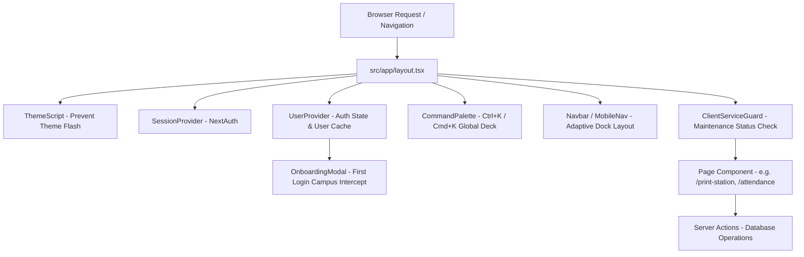
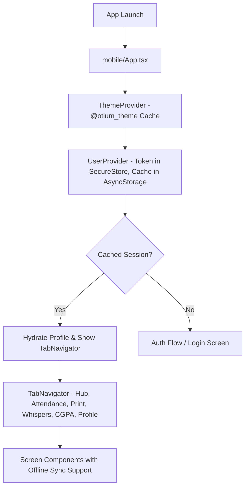

# Otium Uni Hub — Frontend UI/UX Architecture & Design System Guide

> **Target Audience:** AI Engineering Agents & Human Developers  
> **Status:** Living Master Specification  
> **Rule for Agents:** You **MUST** read this document before touching any frontend code on Web or Mobile. After making **ANY** frontend UI/UX change, you **MUST** update this document to keep it synchronized with the codebase.

---

## Table of Contents
1. [Agent Operational Directives & Rules of Engagement](#1-agent-operational-directives--rules-of-engagement)
2. [High-Level Frontend Architectural Flow](#2-high-level-frontend-architectural-flow)
   - [A. Web Platform Flow (Next.js 14 App Router)](#a-web-platform-flow-nextjs-14-app-router)
   - [B. Mobile Platform Flow (React Native / Expo 54)](#b-mobile-platform-flow-react-native--expo-54)
3. [Universal Theme System & Multi-Theme Engine](#3-universal-theme-system--multi-theme-engine)
   - [The 4 Core Themes](#the-4-core-themes)
   - [Step-by-Step Guide: How to Add a New Theme](#step-by-step-guide-how-to-add-a-new-theme)
4. [Component Library & Parity Map (Web vs Mobile)](#4-component-library--parity-map-web-vs-mobile)
5. [Core Screen Layouts, UI Hierarchy & UX Workflows](#5-core-screen-layouts-ui-hierarchy--ux-workflows)
   - [1. Dashboard / Campus Hub](#1-dashboard--campus-hub)
   - [2. Express Printing (Formerly Hostel Print)](#2-express-printing-formerly-hostel-print)
   - [3. 75% Attendance Guardrail & Offline Sync](#3-75-attendance-guardrail--offline-sync)
   - [4. Whisper Wall (Formerly Incognito)](#4-whisper-wall-formerly-incognito)
   - [5. CGPA & SGPA Forecaster](#5-cgpa--sgpa-forecaster)
   - [6. Profile & Live Theme Switcher](#6-profile--live-theme-switcher)
   - [7. Phase 1 Messaging & Express Print In-App Updates](#7-phase-1-messaging--express-print-in-app-updates)
   - [8. Cab Split & RideShare](#8-cab-split--rideshare)
   - [9. Campus Lost & Found](#9-campus-lost--found)
   - [10. Student Marketplace](#10-student-marketplace)
   - [11. Campus Freelance Gigs](#11-campus-freelance-gigs)
6. [Motion Design, Animations & Micro-Interactions](#6-motion-design-animations--micro-interactions)
7. [Agent Maintenance Checklist & Updating Rules](#7-agent-maintenance-checklist--updating-rules)

---

## 1. Agent Operational Directives & Rules of Engagement

### ⚠️ MANDATORY RULES FOR ALL AI AGENTS:

1. **DOCUMENT SYNCHRONIZATION OBLIGATION**:
   Whenever you alter existing UI components, add new screens, introduce new themes, change navigation routes, or adjust animation parameters, you **must immediately update this file (`FRONTEND_UI_UX_ARCHITECTURE.md`)** to reflect your changes. Leaving this document out of date is unacceptable.

2. **WEB & MOBILE PARITY**:
   Otium Uni Hub exists simultaneously as a Next.js 14 web app and a React Native Expo mobile app. Whenever you build or fix a feature for one platform, evaluate if the counterpart platform requires the same upgrade (e.g., anti-double-click cooldowns, campus selection, theme responsiveness, read-more expansion).

3. **STRICT THEME DISCIPLINE — NO HARDCODED COLOR VALUES**:
   - **On Web**: Never use hardcoded colors like `text-white`, `bg-black`, `bg-gray-800`, or arbitrary hex codes in components. Always utilize semantic Tailwind/CSS variables:
     - `bg-background` (Page background)
     - `text-foreground` (Primary high-contrast text)
     - `text-muted-foreground` (Secondary label text)
     - `bg-card` and `border-border` (Card containers)
     - `bg-primary` and `text-primary-foreground` (Brand callouts)
     - `bg-secondary` (Subtle container backdrops)
     - `bg-destructive` (Danger states)
   - **On Mobile**: Never hardcode `#ffffff`, `#000000`, or raw hexes into styles. Always consume theme tokens via `useTheme()`:
     ```tsx
     const { colors, isDark } = useTheme();
     // Use: colors.background, colors.surface, colors.text, colors.textMuted, colors.primary, colors.border
     ```

4. **LEAN BRAND NOMENCLATURE**:
   Legacy names have been retired. Do not re-introduce them in UI copy:
   - ❌ `Hostel Printing` / `Hostel Print` ➔ ✅ **`Express Printing`** or **`Express Print Station`**
   - ❌ `Incognito Wall` / `Incognito Post` ➔ ✅ **`Whisper Wall`** / **`Anonymous Whisper`**
   - ❌ `Incognito Handle` ➔ ✅ **`Whisper Wall Alias`** or **`Anonymous Alias`**

5. **PERFORMANCE & LAYOUT STABILITY**:
   - Avoid heavy blocking loading screens that unmount route layouts. Use top telemetry pulse bars (`h-0.5 animate-pulse`) and compact orbital indicators.
   - Cache user profile data in `sessionStorage` (web) and `AsyncStorage` / `SecureStore` (mobile) to achieve instantaneous 0ms client-side hydration.
   - Keep query bounds (`take: 40`) on server actions to stop unbounded full-table scans.

---

## 2. High-Level Frontend Architectural Flow

### A. Web Platform Flow (Next.js 14 App Router)



1. **Root Layout (`src/app/layout.tsx`)**:
   - Executes `ThemeScript` inline in the document head to read `otium-theme` from `localStorage` before paint, preventing white flash on dark modes.
   - Wraps the application tree in `SessionProvider` (NextAuth), `UserProvider` (global user context), and `Toaster` (Sonner toast notifications).
   - Mounts the global `<CommandPalette />` for `Ctrl+K` navigation and `<OnboardingModal />`.

2. **Client State & Hydration (`src/components/providers/UserContext.tsx`)**:
   - Reads cached user state from `sessionStorage` (`otium_cached_web_user`) immediately on mount to render profile badges in 0ms.
   - Asynchronously validates the session against `/api/auth/me` in the background.
   - Provides `user`, `loading`, `refreshUser()`, and `handleSignOut()`.

3. **Campus Onboarding Intercept (`src/components/OnboardingModal.tsx`)**:
   - Automatically intercepts authenticated students if `user && !user.collegeId`.
   - Prompts for **University Campus** (required), with optional fields for **Phone Number**, **Department**, and **Academic Year**.
   - Ensures that multi-campus data isolation (marketplace listings, campus whisper feeds, delivery drops) is properly scoped from session 1.

4. **Service Maintenance Guard (`src/components/ClientServiceGuard.tsx` & `mobile/src/components/ClientServiceGuard.tsx`)**:
   - Guards all student modules (`PRINT_STATION`, `ATTENDANCE`, `INCOGNITO_WALL`, `GIG_HUB`, `MARKETPLACE`, `CAB_SPLIT`).
   - If an admin toggles a campus service off, the screen renders an amber hazard radar beacon with custom admin notice and an interactive "Ping Service Status" Framer Motion button that checks service recovery in real-time.
   - **Mobile Parity & Offline Cache**: Mobile `ClientServiceGuard` caches service statuses in `AsyncStorage` (`@otium_cached_services_${collegeId}`) so service guards hydrate instantaneously on launch and gracefully fallback to cached values if the device is experiencing intermittent network connectivity.
   - **API Error Interceptor (`mobile/src/services/apiClient.ts`)**: Automatically checks if responses return `text/html` (such as 404 or 500 error pages) and converts them to human-readable error messages, preventing raw HTML from ever being displayed in mobile alerts.

---

### B. Mobile Platform Flow (React Native / Expo 54)



1. **App Bootstrap (`mobile/App.tsx`)**:
   - Restores the active theme from `@otium_theme` (`AsyncStorage`) and applies corresponding `StatusBar` style (`light-content` vs `dark-content`).
   - Restores session credentials from `SecureStore` (`@otium_auth_token`) and profile data from `AsyncStorage` (`@otium_cached_user`).
   - If offline or network times out, the app boots cleanly into cached mode without kicking the student out to login.

2. **Navigation Hierarchy (`mobile/src/navigation/TabNavigator.tsx`)**:
   - Renders a floating bottom tab bar with safe-area insets:
     - 🏠 **Hub** (`DashboardScreen.tsx`): Overview, attendance safety gauge, quick launcher.
     - 📅 **Attendance** (`AttendanceScreen.tsx`): Course cards, liquid slider, bunk/recovery math.
     - 🖨️ **Print** (`PrintStationScreen.tsx`): Document upload, page calculation, cooldown protection.
     - 👁️ **Whispers** (`WhisperWallScreen.tsx`): Campus wall, inline read-more, full-screen post modal.
     - 🎓 **CGPA** (`CgpaPredictorScreen.tsx`): 270° SVG radial dial gauge, target semester forecast.
     - 👤 **Profile** (`ProfileScreen.tsx`): Live theme picker, contact details, anonymous alias.

3. **Standalone APK & EAS Build Requirement (Google OAuth Strict Security Policy)**:
   > [!IMPORTANT]
   > **EXPO GO CANNOT BE USED FOR AUTHENTICATION**:
   > Standard Expo Go **cannot** execute Google Sign-In due to Google Cloud OAuth's strict security architecture:
   > - Google OAuth requires exact registration of the Android package name (`com.otium.unihub`) and the release/debug SHA-1 signing certificate fingerprint.
   > - The generic Expo Go client runs under `host.exp.exponent` with Expo's shared debug key, which Google OAuth rejects with `DEVELOPER_ERROR` (Status Code 10).
   > - Therefore, mobile testing and production use **MUST** be compiled into a standalone APK via EAS Build (`npx eas-cli build --platform android --profile preview`) or a local development client (`npx expo run:android`), which embeds `@react-native-google-signin/google-signin` and native Gradle plugins.

---

## 3. Universal Theme System & Multi-Theme Engine

Otium Uni Hub features **4 synchronized platform themes** across Web and Mobile.

### The 4 Core Themes

| Theme ID | Name | Core Aesthetic | Primary Accent | Background Base |
| :--- | :--- | :--- | :--- | :--- |
| `cyber-neon` | **Obsidian Cyber** | Dark futuristic cyber grid with electric cyan/teal accents | Electric Cyan (`#14b8a6` / `#2dd4bf`) | Deep Obsidian (`#050811`) |
| `emerald-campus` | **Emerald Campus** | Collegiate organic sage, pine & varsity green tones | Campus Emerald (`#059669` / `#10b981`) | Deep Evergreen Slate (`#06130d`) |
| `minimal-luxe` | **Minimal Luxe** | High-end paper & architectural black ink with taupe highlights | Warm Luxury Taupe (`#d97706` / `#b45309`) | Rich Charcoal Canvas (`#09090b`) |
| `minimal-dark` | **Minimal Dark** | Stark monochrome OLED black & pure white high contrast | Crisp Polar White (`#ffffff` / `#e4e4e7`) | OLED Pitch Black (`#000000`) |

---

### Step-by-Step Guide: How to Add a New Theme

Follow this exact 5-step protocol whenever adding a 5th or custom campus theme:

#### Step 1: Define CSS Variables on Web (`src/app/globals.css`)
Open `src/app/globals.css` and add your new theme block under the existing theme selectors:

```css
[data-theme="nordic-frost"] {
  --background: 215 28% 9%;
  --foreground: 210 40% 98%;
  --card: 217 24% 12%;
  --card-foreground: 210 40% 98%;
  --popover: 217 24% 12%;
  --popover-foreground: 210 40% 98%;
  --primary: 199 89% 48%;          /* Frost Blue */
  --primary-foreground: 0 0% 100%;
  --secondary: 217 20% 18%;
  --secondary-foreground: 210 40% 98%;
  --muted: 217 19% 22%;
  --muted-foreground: 215 20% 65%;
  --accent: 199 89% 48%;
  --accent-foreground: 0 0% 100%;
  --destructive: 0 62% 30%;
  --destructive-foreground: 210 40% 98%;
  --border: 217 20% 20%;
  --input: 217 20% 20%;
  --ring: 199 89% 48%;
  --metallic-shine: linear-gradient(135deg, rgba(56, 189, 248, 0.25) 0%, rgba(255, 255, 255, 0.05) 50%, rgba(56, 189, 248, 0.25) 100%);
}
```

#### Step 2: Register the Theme in Web Command Palette (`src/components/CommandPalette.tsx`)
Locate `THEME_ACTIONS` in `src/components/CommandPalette.tsx` and append:

```typescript
{
  id: "theme-nordic-frost",
  category: "Themes",
  title: "Switch to Nordic Frost",
  subtitle: "Glacial blue and arctic deep contrast",
  icon: Palette,
  keywords: ["theme", "nordic", "frost", "blue", "ice"],
  action: () => applyTheme("nordic-frost"),
}
```

#### Step 3: Define the Mobile Theme Object (`mobile/src/theme/themes.ts`)
Open `mobile/src/theme/themes.ts` and define the typed theme configuration:

```typescript
export const nordicFrostTheme: ThemeDefinition = {
  id: "nordic-frost",
  name: "Nordic Frost",
  tagline: "Glacial blue and arctic deep contrast",
  isDark: true,
  colors: {
    background: "#0c121e",
    surface: "#131b2e",
    cardSecondary: "#1a253d",
    primary: "#38bdf8",
    primaryDark: "#0284c7",
    accent: "#7dd3fc",
    text: "#f0f9ff",
    textMuted: "#94a3b8",
    border: "rgba(56, 189, 248, 0.2)",
    cardBorder: "rgba(56, 189, 248, 0.15)",
    danger: "#f87171",
    warning: "#fbbf24",
    success: "#34d399",
  },
};
```

#### Step 4: Register in Mobile Theme Array (`mobile/src/theme/themes.ts`)
Add the new theme to `AVAILABLE_THEMES` and `THEMES_MAP`:

```typescript
export const AVAILABLE_THEMES: ThemeDefinition[] = [
  obsidianCyberTheme,
  emeraldCampusTheme,
  minimalLuxeTheme,
  minimalDarkTheme,
  nordicFrostTheme, // <-- Append here
];

export const THEMES_MAP: Record<string, ThemeDefinition> = {
  "cyber-neon": obsidianCyberTheme,
  "emerald-campus": emeraldCampusTheme,
  "minimal-luxe": minimalLuxeTheme,
  "minimal-dark": minimalDarkTheme,
  "nordic-frost": nordicFrostTheme, // <-- Append here
};
```

#### Step 5: Verify Both Platforms
1. Run `npx next build` in workspace root to ensure web CSS compiles.
2. Run `npx tsc --noEmit` in `mobile/` to verify mobile theme types.
3. Open `ProfileScreen.tsx` on mobile to confirm the new card appears in the grid.

---

## 4. Component Library & Parity Map (Web vs Mobile)

Otium maintains a strict 1:1 component design equivalence between shadcn/ui on Web and our custom React Native primitives:

| Element | Web Component (`src/components/ui/`) | Mobile Component (`mobile/src/components/ui/`) | Styling Notes |
| :--- | :--- | :--- | :--- |
| **Button** | `button.tsx` | `Button.tsx` | Variants: `default`, `secondary`, `outline`, `destructive`, `ghost`. Supports `isLoading` with orbital spinner, and `leftIcon` / `rightIcon` slots. Fully theme-driven via `useTheme()`. |
| **Card** | `card.tsx` | `Card.tsx` | Variants: `default`, `outline`, `secondary`. Uses border tokens and surface elevation. |
| **Badge** | `badge.tsx` | `Badge.tsx` | Variants: `default`, `secondary`, `outline`, `primary`, `success`, `warning`, `destructive`. Legacy `components/Badge.tsx` with static hex colors was retired in favor of `components/ui/Badge.tsx`. |
| **Spinner** | `spinner.tsx` (Framer Motion) | `Spinner.tsx` (Animated SVG) | Variants: `orbit` (dual counter-rotating rings + satellite particle), `radar` (expanding sonar rings), `classic` (gradient arc). |
| **Radial CGPA Gauge** | `RadialCgpaGauge.tsx` | `RadialCgpaGauge.tsx` | 270° SVG arc meter (0.00 - 10.00 scale), animated spring sweep, centered GPA readout, tier badge. |
| **Print Order Tracker** | `PrintOrderTracker.tsx` | `PrintOrderTracker.tsx` | Horizontal laser timeline connecting `Submitted` → `Printing` → `Dispatched` → `Ready`. |
| **Service Guard** | `ClientServiceGuard.tsx` | `ClientServiceGuard.tsx` | Concentric amber hazard beacon, campus maintenance notice, and live "Ping Service" check backed by `GET /api/services?campusId=...` for all campus modules. |

### 4.1 Component Sanitation & Retired Legacy Artifacts (v2.5 Audit)
- **Unified Badge System**: Retired legacy `mobile/src/components/Badge.tsx` (hardcoded hex colors). All screens and modals (`LoginScreen`, `NotificationsModal`) consume `mobile/src/components/ui/Badge.tsx` with dynamic semantic colors from `useTheme()`.
- **Button Standardization**: Purged duplicate `mobile/src/components/ui/GradientActionButton.tsx` and its wrapper `MintButton.tsx`. All primary interactive actions consume `mobile/src/components/ui/Button.tsx`.
- **Dynamic Theming Compliance**: 100% of mobile components (`CircularProgress`, `GlassCard`, `NotificationsModal`, `LoginScreen`) now strictly consume dynamic theme tokens (`colors.primary`, `colors.success`, `colors.destructive`, `colors.card`, `colors.border`) from `useTheme()`, with zero static color imports.
- **Direct Imports over Barrels**: All mobile screen imports use direct module paths; legacy `mobile/src/features/*/index.ts` barrel files were pruned to optimize bundling and eliminate cyclical resolution overhead.

---

## 5. Core Screen Layouts, UI Hierarchy & UX Workflows

### 1. Dashboard / Campus Hub
* **Web**: `src/app/dashboard/page.tsx`
* **Mobile**: `mobile/src/screens/DashboardScreen.tsx`
* **UX Principles**:
  - Dynamic university campus badge derived directly from `{user?.college?.name || "JCBOSEUST, YMCA"}` with fast switcher.
  - 75% attendance circular health summary widget.
  - Standardized portal launcher deck: all 8 service tiles use cohesive semantic background tint `colors.primary + "14"` and primary accent tags, eliminating ad-hoc color clashes.
  - Telemetry notifications panel showing recent campus orders and deliveries.

---

### 2. Express Printing (Formerly Hostel Print)
* **Web**: `src/app/print-station/page.tsx`
* **Mobile**: `mobile/src/screens/PrintStationScreen.tsx`
* **UX Principles & Checkout Architecture**:
  - **Client Service Guard**: Wrapped in `<ClientServiceGuard serviceKey="PRINT_STATION">` checking real-time printer availability per campus.
  - **Document Selection**: PDF upload with direct-to-cloud resumable streaming and client-side page detection (`pdf-lib`).
  - **Configuration**: Duplex selection (B&W Double, B&W Single, Color Single, Color Double). Single-page discount bypass prevention is enforced on the server.
  - **Guaranteed Dynamic UPI ID**: Defaults to `8307798816@upi`, migrates legacy dummy DB values in `getPlatformSettingsAction`, caches locally in `@otium_cached_upi_id`, and refreshes dynamically from `GET /api/settings`.
  - **₹5.00 Minimum Campus Order Floor**: Enforces a ₹5.00 minimum threshold (`Math.max(5.0, rawCost)`) on both client and server (`MINIMUM_ORDER_PAISE = 500`) to deter pranks and cover hostel courier handling fees. The UI visibly illustrates the floor adjustment item (+₹X.XX) if subtotal is under ₹5.
  - **Dedicated Full Checkout Modal (`isCheckoutModalOpen`)**: Replaces cluttered inline forms with a dedicated checkout bottom-sheet modal:
    - Itemized summary breakdown (PDF filename, page count, format, copies, drop location, delivery window).
    - Subtotal and Minimum Floor adjustment line.
    - 1-tap UPI ID Copy button & deep-link `"Pay with UPI App"`.
    - 12-digit transaction UTR number validation.
  - **Hermes-Safe PDF Page Calculation & Interactive Stepper**:
    - Replaced the unsupported `FileReader.prototype.readAsBinaryString` (which threw exceptions in React Native Hermes and defaulted to 1 page) with `FileReader.readAsText` and robust multi-regex page detection (`/\/Type\s*\/Page[^s]/g` and `/\/Count\s+(\d+)/`).
    - Added an interactive **Page Count Stepper** `[-] [ N Page(s) ] [+]` on the picked document card, giving students full control to verify or adjust page counts instantly.
  - **Animated Order Refresh**: An animated 360° spinning icon on the refresh button (`Animated.Value`) along with `RefreshControl` on the `ScrollView` gives users immediate visual confirmation that the campus order queue is refreshing.
  - **Auto-Loading on Boot**: Orders auto-query `/api/print/order?userId=${user.id}` on `[user?.id]`, eliminating 401 unauthenticated errors and blank states.
  - **Anti-Spam 4-Second Submission Cooldown**:
    ```tsx
    setCooldownSeconds(4);
    const timer = setInterval(() => {
      setCooldownSeconds((prev) => {
        if (prev <= 1) { clearInterval(timer); return 0; }
        return prev - 1;
      });
    }, 1000);
    // Button is disabled with label: "✓ Order Placed! Please wait (4s)..."
    ```
  - **Order Tracking & Observable Issue State**:
    - Renders `PrintOrderTracker` displaying the live status pipeline.
    - When `status === "ISSUE_REPORTED"`, an observable amber alert node and hazard banner are rendered directly inside the delivery timeline stepper, detailing the reported problem and status ("Under Review").
    - **Report Problem Action**: Both Web and Mobile feature a "Report Problem" modal dialog allowing students to report issues (Print quality faded, wrong/missing pages, drop location delivery issue, payment verification) with detailed notes.
  - **One-Way In-App System Dispatch Bot ("Express Print Station")**:
    - A dedicated system bot account (`Express Print Station` / `printing@otiumhub.in`) automatically sends transactional in-app SMS-style messages into the student's messaging inbox.

---

### 3. 75% Attendance Guardrail & Offline Sync
* **Web**: `src/app/attendance/page.tsx`
* **Mobile**: `mobile/src/screens/AttendanceScreen.tsx`
* **UX Principles, Gesture Logging & Reconciled Offline Sync**:
  - **Swipe-to-Log Gestures (`SwipeableSubjectCardItem`)**:
    - Interactive `PanResponder` on subject cards: **Swipe Right ➔ `+ Present`**, **Swipe Left ➔ `+ Absent`**.
    - Integrates tactile haptic feedback (`Vibration.vibrate(45)`), color-coded background reveals (emerald right, rose left), and spring recoil upon gesture release.
    - Direction lock ratio (`|dx| > |dy| * 1.5`) prevents horizontal swipe interference during vertical scrolling.
  - **Interactive Stepper & Quick-Select Target**:
    - Replaced slippery sliders with a responsive numeric stepper `[-] [ 75% ] [+]` combined with direct editable text input.
    - Quick-snap preset chips for one-tap policy switching: `65% Medical`, `75% Standard`, `80% Strict`, `85% Honors`, `90% Dean's List`.
  - **Uncluttered Card Layout**:
    - Duration numbers removed from action buttons: buttons read cleanly **`+ Present`** and **`+ Absent`**.
    - Weight duration badge (`3h Lab` / `2 Periods`) is displayed cleanly in the header next to the subject name.
  - **Strict Semantic Theming**:
    - Purged all hardcoded `#ef4444` / `#22c55e` across all themes; strictly consumes semantic tokens (`colors.success`, `colors.destructive`, `colors.primary`, `colors.border`).
  - **Non-Destructive Reconciled Fast Live Sync**:
    - In `POST /api/attendance`, passes `userId: user?.id` with a 3.5s timeout.
    - Merges offline logged counts non-destructively: local attended/total increments are added to remote base counts rather than being wiped by stale server responses.
    - Prevents falling into offline mode on app boot by hooking sync triggers to `[user?.id]`.

---

### 4. Whisper Wall (Formerly Incognito)
* **Web**: `src/app/incognito/page.tsx` & `src/app/incognito/[postId]/page.tsx`
* **Mobile**: `mobile/src/screens/WhisperWallScreen.tsx`
* **UX Principles, Multi-Image Carousel & Responsive Likes**:
  - **Instant 0ms Lag-Free Heart Like**:
    - Replaced laggy up/down voting with a responsive Heart / Like button matching Web and the database `PostLike` schema.
    - Backed by `/api/incognito` handling `action === "LIKE"`, updating UI instantly with 0ms lag without full-feed reloads.
  - **Multi-Media Attachment & Carousel Gallery**:
    - Supports uploading up to 4 images per whisper via `expo-document-picker` with `multiple: true`.
    - Compose modal features horizontal thumbnail preview row with individual `(X)` delete badges and `+ Add Image` chip.
    - Feed posts display single responsive photo or horizontal carousel gallery with `idx/total 📸` counter badge.
    - `/api/upload` incorporates a local filesystem disk fallback (`public/uploads`) returning fully qualified HTTP URLs so uploads never fail with 500.
  - **1-Tap Direct Whisper DMs Access**:
    - Dedicated "DMs" button in the Whisper Wall header navigating directly to `Messages` (`initialTab: "whisper"`).
  - **Inline "Read more" & Full-Screen Modal**:
    - Posts exceeding 180 chars show inline `"Read more ▾"` / `"Show less ▴"`.
    - Full View modal displays full-resolution images, Heart like button, and direct `"Start Whisper DM"` action.

---

### 5. CGPA & SGPA Forecaster
* **Web**: `src/app/cgpa/page.tsx`
* **Mobile**: `mobile/src/screens/CgpaPredictorScreen.tsx`
* **UX Principles & Multi-Semester Engine**:
  - **Semester Persistence & Default**:
    - Purged the bug that arbitrarily forced users to Semester 3 (`maxArchived + 1`).
    - Defaults to Semester 1 on boot or reads the student's selected semester from `@otium_cgpa_selected_sem`.
    - Tapping any semester chip immediately persists the choice.
  - **8-Semester Switcher**: Horizontal selector tabs (`Sem 1` through `Sem 8`) with verified checkmark badges (`✓`).
  - **Dual-View Architecture**:
    - **Term Worksheet View**: Interactive credit inputs (1-6) and letter grade chips (`O: 10`, `A+: 9`, `A: 8`, `B+: 7`, `B: 6`, `C: 5`, `P: 4`, `F: 0`), real-time term SGPA radial gauge, and a "Save Semester to Transcript" button.
    - **Transcript Archive View**: Comprehensive record of all verified past semesters showing university honors tier badges, total credit counts, course breakdowns, and quick-actions to either "Edit in Worksheet" or "Delete" (`DELETE /api/cgpa`).
  - **Accurate Cumulative Math (Zero Double-Counting)**:
    $$\text{CGPA} = \frac{\sum_{s \neq \text{active}} (\text{SGPA}_s \times \text{Credits}_s) + \text{Active Points}}{\sum_{s \neq \text{active}} \text{Credits}_s + \text{Active Credits}}$$
  - **Target CGPA Forecaster**: Interactive credit & target simulator calculating required future SGPA.

---

### 6. Profile & Live Theme Switcher
* **Web**: `src/app/profile/page.tsx`
* **Mobile**: `mobile/src/screens/ProfileScreen.tsx`
* **UX Principles**:
  - **Interactive Theme Grid**: Cards showing theme swatches, title, tagline, and active selection indicator. Tapping switches the active theme immediately and persists to storage.
  - **Anonymous Pseudonym Management**: Edit Whisper Wall handle and re-seed avatar identity.
  - **Academic & Contact Meta**: Manage campus affiliation, department, and SMS delivery phone.

---

### 7. In-App Messaging & Express Print In-App Updates
* **Web**: `src/app/messages/page.tsx`
* **Mobile**: `mobile/src/screens/MessagesScreen.tsx`
* **UX Principles & Realtime Architecture**:
  - **Live Chat Engine**: Dual real-time connection with WebSockets (`Socket.io`) and a 2.5s delta sync fallback (`?after=timestamp`).
  - **Zero-Lock Non-Blocking Optimistic Dispatch**:
    - Purged artificial `isSending` locks and send button disabling across both Web and Mobile.
    - Generates cryptographically unique optimistic message IDs (`temp-${Date.now()}-${random}`) and unshifts/appends them instantly.
    - Enables users to fire consecutive back-to-back messages without delay or network lockout.
  - **WhatsApp / Instagram Style Delivery Indicators**:
    - Every message bubble renders a delivery state indicator: `⏱` for in-flight sending, `✓✓` for confirmed server receipt, and `!` with destructive highlighting for failed dispatches.
  - **In-Window Conversation Filtering & Search**:
    - Added an in-window search bar right below the dual-inbox tab switcher on both Web and Mobile.
    - Instantly filters conversations by student name, `@username`, anonymous alias, or message content without opening secondary modals.
  - **Universal Classmate Search Modal**: Debounced modal querying `@username`, student name, and department with **ZERO email exposure**.
  - **Web Scoped Container Scrolling**:
    - Replaced `scrollIntoView()` with `messagesContainerRef.current.scrollTo({ top: scrollHeight, behavior })`.
    - Guarantees the browser window/page never jumps down to the footer when sending or receiving messages.
  - **Mobile Soft Keyboard & Enter-to-Send UX**:
    - Configured `TextInput` with `multiline={false}`, `returnKeyType="send"`, `blurOnSubmit={false}`, and `onSubmitEditing={(e) => handleSendMessage(e.nativeEvent?.text)}`.
    - Tapping the soft keyboard Enter / Return / Send key immediately fires the message while keeping the keyboard focused for typing the next message.
  - **Mobile Dynamic Insets & Full-Screen In-Place Thread**:
    - Chat is rendered full-screen in-place with `navigation.setOptions({ tabBarStyle: { display: "none" } })` and `tabBarHideOnKeyboard: true`.
    - Listens to native `keyboardDidShow` / `keyboardDidHide` events to dynamically drop bottom inset padding from `Math.max(insets.bottom, 10)` down to `6px` when the keyboard is open, preventing the input bar from floating or occluding behind the navigation bar.
    - Android hardware `BackHandler` cleanly exits the active chat and restores the bottom tab bar.
  - **Route Tab Synchronization**: Deep-linking with `initialTab: "whisper"` or `initialTab: "direct"` automatically focuses the corresponding inbox tab.
  - **Dashboard Portal Launcher**: Quick tile in `DashboardScreen` launches directly into `Messages`.
  - **Whisper Wall Direct DM Fallback**: When initiating a DM from an anonymous whisper post, the client creates a responsive local whisper conversation session with tab auto-selection even if the remote backend endpoint is in transit.

---

### 8. Cab Split & RideShare
* **Web**: `src/app/rideshare/page.tsx`
* **Mobile**: `mobile/src/screens/RideShareScreen.tsx`
* **UX Principles**:
  - **Client Service Guard**: Wrapped in `<ClientServiceGuard serviceKey="CAB_SPLIT">`.
  - **Zero Mock Data**: Purged `INITIAL_FALLBACK_RIDES`.
  - **Editable Campus Origin**: Pickup origin is fully editable with interactive campus quick-chips ("JC Bose Gate", "Hostel Block 1", "YMCA Library", "Faridabad Metro").
  - Origin & Destination route markers with connecting visual path.
  - Per-seat calculated split fare badge in ₹.
  - Real-time seat reservation action with host notification.
  - Bottom sheet modal for hosting new cab splits with provider chips (`Uber XL`, `Ola Prime`, `Rapido`, `InDrive`).
  - Search filter by transit destination (Airport, Railway Station, Metro).

---

### 9. Campus Lost & Found
* **Web**: `src/app/lost-and-found/page.tsx`
* **Mobile**: `mobile/src/screens/LostAndFoundScreen.tsx`
* **UX Principles**:
  - **Client Service Guard**: Wrapped in `<ClientServiceGuard serviceKey="LOST_AND_FOUND">`.
  - **Zero Mock Data**: Purged `INITIAL_FALLBACK_ITEMS`.
  - Horizontal category selector chips (`Electronics`, `ID Cards & Keys`, `Wallets & Bags`, `Books & Notes`, `Other`).
  - Photo preview cards with location found and date tags.
  - One-tap claim action and direct "Chat with Finder" button navigating to Messages.
  - Bottom sheet modal for reporting found belongings with photo URL and identifying mark description.

---

### 10. Student Marketplace
* **Web**: `src/app/marketplace/page.tsx`
* **Mobile**: `mobile/src/screens/MarketplaceScreen.tsx`
* **UX Principles**:
  - **Client Service Guard**: Wrapped in `<ClientServiceGuard serviceKey="MARKETPLACE">`.
  - **Zero Mock Data**: Purged `INITIAL_FALLBACK_MARKETPLACE`.
  - Peer-to-peer campus classifieds with zero middleman commissions.
  - Categories: `Books & Notes`, `Electronics`, `Cycles & Transport`, `Furniture`, `Hostel Essentials`, `Clothing`.
  - Condition tags: `Brand New`, `Like New (Mint)`, `Good`, `Fair / Used`.
  - Owner actions: "Mark Sold" and "Remove Listing".
  - Buyer actions: "Message Seller" creating instant direct conversation in Messages.
  - Bottom sheet "List an Item" modal with photo upload and price inputs.

---

### 11. Campus Freelance Gigs
* **Web**: `src/app/gigs/page.tsx`
* **Mobile**: `mobile/src/screens/GigsScreen.tsx`
* **UX Principles**:
  - **Client Service Guard**: Wrapped in `<ClientServiceGuard serviceKey="CAMPUS_GIGS">`.
  - **Zero Mock Data**: Purged `INITIAL_FALLBACK_GIGS`.
  - Peer freelance marketplace with proxy escrow protection notices.
  - Categories: `Coding & Dev`, `Assignments & Reports`, `UI/UX & Design`, `Projects & Lab Work`, `Research`, `Tutoring`.
  - Bounty display in ₹ with open/assigned/completed status badges.
  - Claim action with anti-hoarding guardrail checks.
  - Bottom sheet modal to post student bounties (minimum ₹50).

---

### 12. Super-App Offline Architecture & Local Storage Parity Map

To ensure flawless mobile operation when walking across campus with dead zones or Wi-Fi packet drops, all student modules implement local persistence and automatic offline sync queues:

| Module | Offline Storage Keys | Offline Fallback Mechanism | Sync Resumption Strategy |
| :--- | :--- | :--- | :--- |
| **Attendance Guardrail** | `@otium_attendance_subjects`<br/>`@otium_attendance_target`<br/>`@otium_attendance_pending_sync` | Immediate 0ms local mutation; advice math recalculated offline; queued in `@otium_attendance_pending_sync` | Two-way reconciliation via `POST /api/attendance` (`SYNC_OFFLINE`); auto-flushes pending queue on pull-to-refresh |
| **Express Print Station** | `@otium_cached_print_orders`<br/>`@otium_print_pending_sync` | Recent orders loaded instantly; offline orders queued as `QUEUED` with `isOfflinePending: true` | `flushOfflinePrintQueue()` on screen mount and refresh; automatically submits pending UTR payloads to `/api/print/order` |
| **CGPA Forecaster** | `@otium_cgpa_semesters`<br/>`@otium_cgpa_active_courses` | Full academic worksheet & transcript semesters cached locally | Saves locally when offline with friendly toast; syncs to `/api/cgpa` when connectivity restored |
| **Whisper Wall** | `@otium_cached_whispers` | Zero hardcoded seeds; cached posts loaded instantly; optimistic up/down votes; offline posts saved locally | New posts append to state & disk; syncs on next pull-to-refresh |
| **Dashboard Hub** | `@otium_cached_dashboard_snapshot` | Cached operational metrics snapshot (Pending prints, attendance safety, open tasks, listings) | 0ms instant display without layout shift; refreshes live counts in background via `/api/print/order`, `/api/gigs`, etc. |
| **Cab Split & RideShare** | `@otium_cached_rides` | Cached listings + interactive campus origin chips ("JC Bose Gate", "Hostel 1", etc.) | Offline ride hosting appends to local list and caches to disk with offline toast notice |
| **Lost & Found** | `@otium_cached_lost_found` | Cached item registry + clean empty state card | Offline found reports append locally to disk; claims marked locally |
| **Student Marketplace** | `@otium_cached_marketplace` | Cached peer classifieds + clean empty state card | Offline listings persist to disk with owner actions preserved |
| **Campus Freelance Gigs** | `@otium_cached_gigs` | Cached bounties + clean empty state card | Offline task postings save to disk with full title, budget, and category details |
| **Dual-Inbox Messages** | `@otium_cached_conversations`<br/>`@otium_thread_[id]` | Cached conversations list + per-thread message history + live classmate search | Optimistic message append; automatic background polling every 12 seconds when online |

---

## 6. Motion Design, Animations & Micro-Interactions

Otium uses physics-based spring transitions rather than linear CSS fades:

1. **Liquid Slider Thumb Physics**:
   - As the slider is dragged horizontally, the thumb physically stretches along the velocity axis (`transform: scaleX(1.25) scaleY(0.88)`). Upon release, it snaps back organically.
2. **Radial CGPA Arc Sweep**:
   - Animated SVG stroke calculation using `strokeDashoffset`:
     $$\text{offset} = \text{circumference} \times \left(1 - \frac{\text{GPA}}{10.0} \times \frac{270^\circ}{360^\circ}\right)$$
3. **Orbital Dual-Ring Spinner**:
   - Outer ring rotates clockwise (`360deg` over 1.6s). Inner ring counter-rotates (`-360deg` over 2.4s). A small satellite dot orbits along the periphery.
4. **Amber Hazard Radar Beacon**:
   - Concentric expanding sonar wave keyframes (`@keyframes sonar-pulse`) communicating maintenance status without alarming users.

---

---

## 8. Mobile & Web Realtime Messaging & Keyboard Architecture (v2.4 Overhaul)

### 8.1 Android Soft Keyboard Layout & Window Resizing Architecture
- **Root Manifest Setting**: Configured `"softwareKeyboardLayoutMode": "resize"` in `mobile/app.json` under `android` and `android:windowSoftInputMode="adjustResize"` in `mobile/android/app/src/main/AndroidManifest.xml`.
- **Bottom Tab Bar Collision Prevention**: In `mobile/src/navigation/TabNavigator.tsx`, hidden portal routes (`Messages`, `CGPA`, `RideShare`, `LostAndFound`, `Marketplace`, `Gigs`) explicitly declare `tabBarStyle: { display: "none" }`. This completely eliminates the 80px fixed height collision and prevents `tabBarHideOnKeyboard` race conditions from displacing the bottom text input.
- **Dynamic Inset & Screen Offset Measurement (`measureInWindow`)**: In `mobile/src/screens/MessagesScreen.tsx`, active chat views mount within a container `<View ref={chatContainerRef} onLayout={handleChatContainerLayout}>` that dynamically queries `chatContainerRef.current.measureInWindow((x, y) => setKeyboardOffset(y))`. Passing this exact screen Y position to `keyboardVerticalOffset` guarantees that `KeyboardAvoidingView` computes the keyboard displacement with 0px margin of error across any device status bar / notch / header configuration.
- **Android Keyboard Avoiding Behavior (`height` strategy)**: Configured `behavior={Platform.OS === "ios" ? "padding" : "height"}` on active chat and modal containers. Rather than relying on `undefined` behavior (which causes Android to leave inputs occluded under edge-to-edge system bars), `height` dynamically shrinks the container while the inverted `<FlatList style={{ flex: 1 }}>` absorbs the delta, docking the input prompt bar snugly above the Android software keyboard.
- **In-Place Overlays & Modal Bottom Sheets**: In `mobile/src/screens/WhisperWallScreen.tsx`, compose and comment reply sheets utilize `behavior="padding"` with `keyboardVerticalOffset={Platform.OS === "android" ? insets.top + 56 : 0}`, lifting anonymous comment reply inputs cleanly over the soft keyboard.
- **Application-Wide Textfield & Modal Audit**:
  - **Attendance Tracker (`AttendanceScreen.tsx`)**: Upgraded both Add Subject and Edit Subject modals from `behavior={undefined}` to `behavior={Platform.OS === "ios" ? "padding" : "height"}`.
  - **Student Profile (`ProfileScreen.tsx`)**: Upgraded Edit Profile modal from `behavior={undefined}` to `behavior={Platform.OS === "ios" ? "padding" : "height"}`.
  - **Campus Freelance Tasks (`GigsScreen.tsx`)**: Upgraded Post Task modal from an unhandled `View` to `<KeyboardAvoidingView behavior={Platform.OS === "ios" ? "padding" : "height"}>`.
  - **Lost & Found (`LostAndFoundScreen.tsx`)**: Upgraded Report Item modal from an unhandled `View` to `<KeyboardAvoidingView behavior={Platform.OS === "ios" ? "padding" : "height"}>`.
  - **Student Marketplace (`MarketplaceScreen.tsx`)**: Upgraded Sell Listing modal from an unhandled `View` to `<KeyboardAvoidingView behavior={Platform.OS === "ios" ? "padding" : "height"}>`.
  - **Cab Split & RideShare (`RideShareScreen.tsx`)**: Upgraded Host Ride modal from an unhandled `View` to `<KeyboardAvoidingView behavior={Platform.OS === "ios" ? "padding" : "height"}>`.
  - **Express Print Station (`PrintStationScreen.tsx`)**: Upgraded both Checkout and Report Problem modals from unhandled `View`s to `<KeyboardAvoidingView behavior={Platform.OS === "ios" ? "padding" : "height"}>`.
- **Header Space Optimization**: Reduced `chatHeader` and `header` top padding on Android from legacy `36px` to `12px` (matching iOS `14px`), reclaiming critical viewport height for chat bubbles and input controls.

### 8.2 WhatsApp & Instagram Message Feed Architecture
- **Inverted Lazy Stream**: Both Mobile and Web use lazy message loading (`take: 25`).
  - Mobile: `inverted={true}` on `<FlatList>` with `data={threadMessages}` ordered descending (`messages[0]` is latest). Sending a message instantly unshifts to index 0. Scrolling up triggers `onEndReached`, loading older messages with `cursor=${oldestMsg.id}`.
  - Web: Inverted scroll container with scroll-up listener, preserving scroll offsets upon prepending older batches.
- **Realtime WebSockets (Socket.io)**: Replaced Supabase Realtime with standalone Socket.io (`socket-client.ts` on Web and `socketClient.ts` on Mobile) running on Render / Koyeb with room partitioning (`conversation_${id}`).
- **Infinite Auto-Reconnect & Cold-Start Resilience**: Configured `reconnectionAttempts: Infinity`, `reconnectionDelay: 1000`, `reconnectionDelayMax: 5000`, and `timeout: 30000`. On the `connect` event, the client automatically re-emits `join_conversation` for the active conversation room. If the server was spinning up from an idle cold start, the client reconnects and syncs effortlessly without user intervention.
- **Zero-Downtime Delta Sync**: Every 2.5s, active chat threads execute a smart background delta fetch: `GET /api/chat/[id]/messages?after=${latestTimestamp}` to ensure 100% packet reliability even while a free-tier WebSocket instance is booting.

### 8.3 Student Privacy & Public Usernames (`@username`)
- **Zero Email Exposure**: University student emails are strictly classified as private credentials. Email has been permanently removed from campus student directory search queries, search results, and chat previews.
- **Public Handles**: Every student user has an optional customizable `@username` handle (3–20 chars, alphanumeric & underscores). Search operates exclusively across `name`, `@username`, and `department`.
- **Pre-filled Active Handle Display**: Both Web `/profile` and Mobile `ProfileScreen` pre-fill the student's existing `@username` with an `@` prefix, displaying a prominent current handle badge so students always see their active username rather than a blank creation prompt.

### 8.4 Full Module Web-Mobile Parity Map
- **Messages**: Web `/messages` provides Dual-Inbox tabs (Direct & Print vs Whisper DMs), New Message classmate search modal (`@username`), and Socket.io realtime.
- **Whisper Wall**: Web `/incognito` DM button links directly to `/messages?id=${conversationId}&initialTab=whisper`.
- **Express Print Station**: Web `/print-station` includes manual Page Count Stepper `[-] [ N ] [+]`, strict ₹5 order floor minimum (`Math.max(500, totalPaise)`), and default UPI fallback `8307798816@upi`.
- **Attendance Guardrail**: Web `/attendance` features clean action buttons (`+ Present`, `+ Absent`), weightage next to course title, threshold target stepper `[-] [ 75% ] [+]`, and instant local cache hydration.
- **Profile**: Web `/profile` and Mobile `ProfileScreen` provide `@username` inspection and live editing.

### 8.5 Mobile Diagnostics & Tooling
- **Expo Doctor Verification**: Registered `"doctor": "npx -y expo-doctor"` in `mobile/package.json` (and `"mobile:doctor": "cd mobile && npx -y expo-doctor"` in root `package.json`). Run to execute the 18-point Expo environment, dependency compatibility, native plugin configuration, and manifest check (`18/18 checks passed. No issues detected!`).

### 8.6 Mobile v1.0.1 (Build 3) Whisper Wall & Service Architecture Overhaul
- **Soft Keyboard Safe In-Place Overlays**: Replaced native React Native `<Modal>` Dialog wrappers for Whisper compose, comments, and full view with in-place absolute overlays (`StyleSheet.absoluteFillObject` + `KeyboardAvoidingView`). Because these overlays exist within the primary Activity hierarchy, Android's native `windowSoftInputMode="adjustResize"` dynamically recalculates available height, preventing keyboard occlusion of text inputs and action buttons.
- **Deferred Image Uploading Pipeline**: Document picker captures local asset URIs with zero network latency on pick (`0ms`). Remote storage upload (`/upload`) is deferred until the user taps "Post Whisper". Print Station PDF uploads remain untouched to preserve page count calculation and pricing estimation.
- **Anonymous Comments Thread & Quick Reply**: Whisper posts include comment counter buttons (`💬 {commentCount}`). Tapping opens an in-place comments sheet rendering anonymous bot avatars (`DiceBear bottts`), timestamps, and thread replies, backed by a docked reply input bar with 0ms optimistic rendering.
- **Whisper Post Deletion**: Posts authored by the active student (`authorId === user.id`) or Super Admins display a delete trash button with a confirmation dialog triggering `DELETE /api/incognito?postId=...`.
- **Zero-Flicker Campus Service Guard**: `ClientServiceGuard` hydrates disabled service state from `@otium_cached_services` immediately on mount, normalizes service keys (`CAMPUS_GIGS` ➔ `GIG_HUB`), and queries `/api/services` with automatic fallback to primary campus records, preventing disabled services from flashing or remaining active.

### 8.7 Offline-First Whisper DMs & WhatsApp/Instagram Chat Engine (Build 3)
- **Top-Left Whisper DMs Button with Unread Marker**: Placed directly on the Hub/Dashboard top navigation row (`topBarRow`), displaying an unread badge marker (`[N]` red pill when unread > 0, or live green pulse dot when 0). Tapping routes directly to `Messages` (`initialTab: "whisper"`).
- **Whisper Tab Header Cleanup**: Removed the DMs button from the Whisper Wall header, making Whisper Wall dedicated to campus posts and comments.
- **Zero-Blocking Chat Initialization**: Chat threads open with `0ms` latency from local `AsyncStorage` cache (`@otium_thread_${conv.id}`) or conversation metadata. The full-screen "Connecting to chat..." blocking spinner has been eliminated. The input bar is immediately interactive and background WebSockets/delta-sync run asynchronously.
- **Local-First Message Storage**: Messages are persisted to `AsyncStorage` on every dispatch, socket packet, and background fetch, guaranteeing chats are retained on-device across app restarts and cold starts.
- **Instagram & WhatsApp "Seen" Receipts**: Displays `Seen ✓✓` in sky blue (`#7dd3fc`) when the peer has replied or viewed the message, `✓✓` upon delivery, `✓` upon sent confirmation, and `⏱` during optimistic sending.

### 8.8 Cloud Production Bundling & Asset Resolution Hardening
- **Metro Bundler Asset Path Resolution**: Verified all nested screen components under `mobile/src/features/*` employ relative imports (`../../../assets/logo.png`) that accurately navigate 3 directory levels to the root `mobile/assets/` directory. This resolves EAS cloud build failures (`Unable to resolve module ../../assets/logo.png`) and guarantees Android/iOS standalone APK compilation parity.

### 8.9 Express Print Station — Immutable Document Page Count
- **Anti-Tampering Read-Only Badge**: Eliminated manual `[-]` and `[+]` page counter buttons on Web (`/print-station`) and Mobile (`PrintStationScreen`). The document page count is strictly determined server-side from PDF bytes via `pdf-lib` and displayed as an immutable status badge (`N pages • Server Verified`), preventing client-side price tampering. Users may only adjust the **Number of Copies** multiplier stepper.

### 8.10 Otium Campus E-Wallet Component Architecture (Phase 1)
- **Web Navigation Balance Pill (`src/components/wallet/WalletPill.tsx`)**: Renders a live, responsive balance badge in the primary navbar with automatic refresh via the `otium:wallet_updated` window event.
- **Topup & Audit Modal (`src/components/wallet/TopupModal.tsx`)**: Provides preset recharge chips (₹50, ₹100, ₹200, ₹500), amount-locked QR codes, UTR input validation, and an immutable double-entry ledger history view displaying exact UTR references, transaction descriptions, and running balance snapshots.
- **Mobile Header Badge & Modal (`mobile/src/components/wallet/WalletHeaderBadge.tsx`, `WalletRechargeModal.tsx`)**: Integrates dynamic `useTheme()` tokens (`colors.card`, `colors.primary`, `colors.border`), UPI deep linking (`upi://pay`), native clipboard integration, and real-time ledger view.

### 8.11 Express Print Station — 1-Click Wallet Checkout & Dual Payment UI (Phase 2)
- **Web Payment Selector (`src/app/print-station/page.tsx`)**:
  - Replaces single UPI section with interactive dual payment cards:
    - **Otium E-Wallet (+2% Cashback)**: Shows live balance, auto-calculates 2% instant cashback, and enables 1-click checkout without QR code or UTR entry. If balance is insufficient, presents dynamic shortage calculator and opens inline `TopupModal`.
    - **Direct UPI App / QR**: Retains amount-locked dynamic QR and 12-digit UTR input for students paying directly via UPI apps.
- **Mobile Checkout Modal Parity (`mobile/src/features/print-station/PrintStationScreen.tsx`)**:
  - Implements theme-adaptive segmented selector consuming `useTheme()` tokens (`colors.primary`, `colors.secondary`, `colors.border`).
  - Supports 1-click submission with instant feedback and embedded `WalletRechargeModal` for immediate top-ups.
  - In accordance with campus administrative policy, customer self-cancellation is removed; order cancellations and refunds are administered exclusively through campus print operators with automatic wallet refund and cashback clawback reversal.
- **Admin Print Rejection Panel Parity (`src/app/admin/print/page.tsx`)**:
  - Provides contextual payment method indicator:
    - **Wallet-paid orders**: Displays interactive `[x] Issue Wallet Refund` toggle (checked by default). Unchecking allows administrators to reject without refunding.
    - **UPI-paid orders**: Displays alert noting direct UPI payment (and submitted UTR), explicitly confirming that no automatic wallet refund will be triggered, safeguarding platform balances against fake/invalid UTR submissions.

### 8.12 Campus E-Wallet Admin Dashboard & Telegram Bot UI (Phase 3)
- **Web Admin Management Page (`src/app/admin/wallet/page.tsx`)**:
  - **KPI Metrics Grid**: 4 responsive cards rendering Total Campus Float (Rupees & Paise, with student count), Pending Approvals (with highlighted amber border & urgency badge when > 0), Approved Today (Rupees credited & count), and Rejected Today (unmatched UTRs).
  - **Telegram Bot Status Pill & Setup Modal**: Displays live green pulsing dot when `TELEGRAM_BOT_TOKEN` & `TELEGRAM_ADMIN_CHAT_ID` are configured in `.env`, or opens an interactive setup guide detailing BotFather token creation, Chat ID discovery, webhook URLs, and previewing the Telegram inline card format.
  - **Interactive Filtering & Search**: Segmented status pills (`All`, `Pending`, `Approved`, `Rejected`) with real-time count badges alongside instant search matching student name, email, phone, and 12-digit UTR.
  - **Monospace UTR with 1-Click Clipboard Copy**: Displays 12-digit UTR references in monospace chips with visual checkmark feedback upon copying, expediting bank statement matching.
  - **1-Tap Admin Approval & Discretionary Rejection**:
    - **Approve**: Dispatches `adminApproveTopupAction`, disables button to prevent double-clicks, and credits student balance in real time.
    - **Reject**: Opens a rejection modal with 4 pre-configured reason chips (*"Payment could not be verified in bank records"*, *"Duplicate UTR"*, *"Amount mismatch"*, *"Reversed transaction"*) or custom note input. Rejection explicitly enforces zero wallet refund/credits.
- **Admin Navigation & Middleware Parity**:
  - Added `Wallet Recharges` link to `src/app/admin/layout.tsx` in both the desktop sidebar and mobile horizontal navigation strip.
  - Configured role protection in `src/middleware.ts` granting access to `PRINT_MANAGER` and `SUPER_ADMIN` roles.

---
*Document maintained by Antigravity AI Engineering Suite.*


