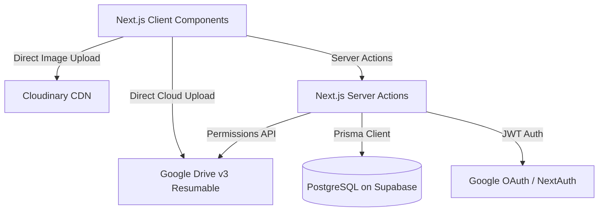
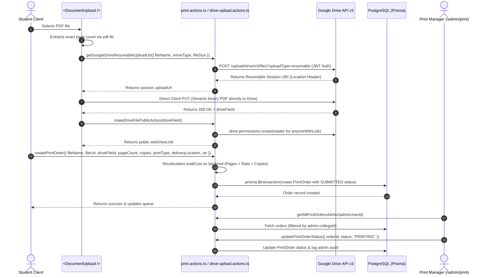

# Otium Uni Hub — System Architecture & Data Flow Documentation

> **Document Version:** 1.0.0  
> **Last Updated:** August 2026  
> **Repository:** `Otium uni hub` (Next.js 14 App Router, Prisma ORM, PostgreSQL via Supabase, Google Drive v3, Cloudinary)

---

## 1. High-Level Architecture Overview

Otium Uni Hub is a campus super-app ecosystem built for university students and administrators. It operates on a **Direct-to-Cloud Upload** paradigm to bypass serverless payload limitations (e.g., Vercel's 4.5MB request ceiling) while ensuring role-based campus segregation, escrow protection, and zero-knowledge anonymity.

---

## 2. Core Module Workflows & Data Flows

### A. Hostel Cloud Print Station (`/print-station` & `/admin/print`)
* **Objective:** Enable students to upload PDF assignments/notes, auto-calculate exact page counts, pay via dynamic UPI QR code, and track express hostel delivery.

#### Data Flow:

---

### B. Incognito Wall (`/incognito` & `/incognito/[postId]`)
* **Objective:** Campus-scoped and global anonymous whisper wall with pseudonym handles, DiceBear Bottts avatars, multi-image attachments, threaded comments, and direct anonymous peer messaging.

#### Data Flow:
1. **Profile Initialization:** If the user lacks an anonymous handle, `createIncognitoPost` or `setupIncognitoProfile` auto-generates a pseudonym (e.g. `Anon_8421`) and an SVG avatar via DiceBear.
2. **Direct Image Uploads:** Images uploaded by students stream directly to Cloudinary unsigned uploads or are attached via URLs.
3. **Feed Filtering:** `getIncognitoPosts({ scope: "CAMPUS" | "GLOBAL", feedType })` fetches posts matching the user's campus or network-wide feed.
4. **Optimistic Reactions:** `toggleLikeIncognitoPost` provides immediate local UI updates, and atomically toggles the `IncognitoLike` record in Prisma.

---

### C. Campus Service Feature Flags (`/admin/services` & `ServiceGuard`)
* **Objective:** Enable Super Admins to dynamically pause or activate specific features (Print Station, Incognito Wall, Marketplace, Cab Split) on a per-campus basis.

#### Data Flow:
1. Super Admin toggles a service key (e.g., `PRINT_STATION`) in `/admin/services`.
2. Invokes `toggleCampusService({ campusId, serviceKey, isEnabled, maintenanceMessage })`.
3. Updates `CampusService` table with composite unique constraint `[campusId, serviceKey]`.
4. Client wraps sensitive features in `<ClientServiceGuard serviceKey="..." />`, querying `getCampusServices` to display a custom maintenance notice if paused for that university.

---

### D. Authentication & Role-Based Access Control (RBAC)
* **Authentication:** NextAuth.js with Google OAuth Provider and Prisma Adapter.
* **Roles:**
  * `SUPER_ADMIN`: Global oversight, all admin consoles (`/admin/*`), campus creation, user role promotions, service toggling, and global print queues.
  * `PRINT_MANAGER`: Access restricted to `/admin/print`, automatically filtered to their assigned `collegeId`.
  * `CAMPUS_MODERATOR`: Content moderation for Incognito Wall and Lost & Found within their campus.
  * `STUDENT`: Standard campus user (Print Station submissions, Gigs, Marketplace, Wall, Chat).

---

## 3. Function & Component Hierarchy

| Module | Client Component Target | Server Action File | Service / External Dependency |
| :--- | :--- | :--- | :--- |
| **Print Station** | `src/app/print-station/page.tsx` `src/components/ui/DocumentUpload.tsx` | `src/actions/print.actions.ts` `src/actions/drive-upload.actions.ts` | Google Drive API v3 (JWT Auth) `pdf-lib` Prisma `PrintOrder` |
| **Print Admin Hub** | `src/app/admin/print/page.tsx` | `src/actions/admin.actions.ts` | Prisma `PrintOrder` Prisma `PrintSetting` Prisma `AuditLog` |
| **Incognito Wall** | `src/app/incognito/page.tsx` `src/app/incognito/[postId]/page.tsx` | `src/actions/incognito.actions.ts` | DiceBear Bottts API Cloudinary Direct Upload Prisma `IncognitoPost` |
| **Campus Services** | `src/app/admin/services/page.tsx` `src/components/ClientServiceGuard.tsx` | `src/actions/admin.actions.ts` | Prisma `CampusService` Prisma `College` |
| **Direct Messaging**| `src/app/messages/page.tsx` | `src/actions/chat.actions.ts` | Supabase Realtime Channels Prisma `Message` / `Conversation` |
| **Platform Config** | `src/app/admin/settings/page.tsx` | `src/actions/platform.actions.ts` | Prisma `PlatformSetting` (UPI ID) |
